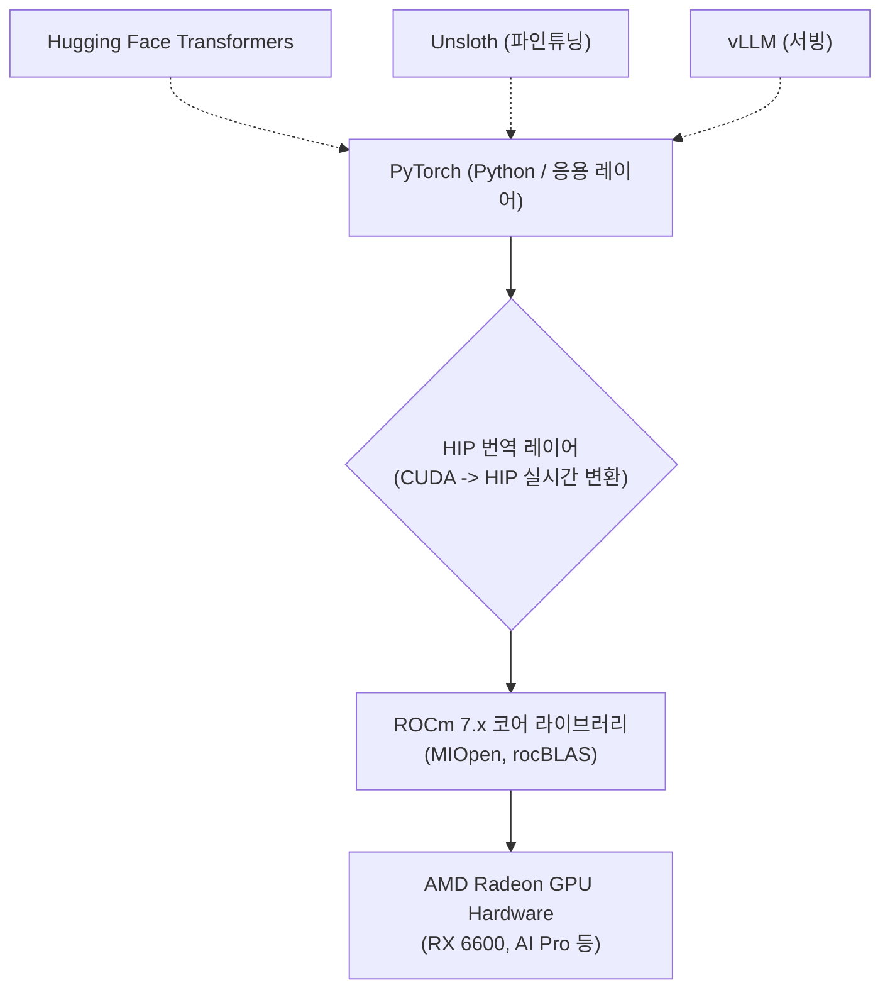

# AMD ROCm AI 소프트웨어 스택 및 PyTorch 네이티브 연동 아키텍처

## 1. 개요
전통적으로 로컬 딥러닝과 AI 생태계는 NVIDIA의 CUDA 플랫폼이 독점해왔으나, 2026년 현재 AMD의 **ROCm (Radeon Open Compute)** 플랫폼과 **HIP (Heterogeneous-Compute Interface for Portability)** 번역 레이어가 성숙함에 따라 CUDA 종속성이 사실상 붕괴되었다. 
본 문서는 소비자용 및 워크스테이션급 AMD GPU(Radeon RX 시리즈 및 AI Pro 시리즈)에서 추론(Inference)과 학습(Training)을 구동하기 위한 소프트웨어 스택과 아키텍처를 정의한다.

---

## 2. Windows 기반 추론 스택 (Out-of-the-Box Inference)
Linux 커맨드라인 환경 구축 없이도 Windows OS 상에서 즉각적인 하드웨어 가속 추론이 가능하다.

### 1) LM Studio 및 Ollama (LLM 런타임)
- **ROCm 내장**: LM Studio 최신 버전은 ROCm 런타임을 내장하여 배포되므로, 설정에서 런타임만 스위칭하면 AMD GPU의 VRAM을 100% 활용한다.
- **성능 (RX 6600 / R9 700 기준)**: 대역폭 병목을 최소화하여 Qwen 3.6 MoE, Gemma 4 등의 최신 4-bit/8-bit 양자화 모델을 초당 100~160 토큰 이상의 속도로 출력(인간 읽기 속도 초과).
- **에이전트 호환성**: OpenAI 호환 API 서버 기능을 켜면 Open Code, Aider 등의 코딩 하네스가 AMD GPU를 백엔드로 투명하게 사용 가능.

### 2) ComfyUI (Generative Vision)
- **ROCm 빌드 제공**: 노드 기반 이미지/비디오 생성의 표준인 ComfyUI가 AMD 전용 패키지를 제공함.
- Stable Diffusion 3, LTX2 비디오 모델 등을 병목 없이 가속.

---

## 3. Linux 기반 Full-Stack 훈련 아키텍처 (Training & Fine-tuning)
직접적인 텐서 연산, 파인튜닝, 커스텀 모델 서빙이 필요한 경우 Linux(Ubuntu 등) 듀얼 부팅 또는 네이티브 환경에서 완벽한 PyTorch 지원을 받는다.

### 1) PyTorch 공식 지원 (Drop-in Replacement)
- PyTorch 공식 홈페이지에서 ROCm 전용 `.whl` 패키지를 제공.
- `import torch` 후 `torch.cuda.is_available()` 호출 시 ROCm 가속 계층을 투명하게 통과하여 하드웨어를 인식함. 기존 CUDA용 PyTorch 스크립트의 99%를 수정 없이 실행 가능.

### 2) Unsloth 및 커스텀 학습 생태계 편입
- 고속 파인튜닝 도구인 Unsloth가 AMD GPU용 공식 빌드 파이프라인을 지원.
- ResNet 등 비전 모델 스크래치 학습부터 LLM LoRA 미세조정까지 VRAM 한도 내에서 에러 없이 구동됨.

---

## 4. 사용자 3-PC 아키텍처: 데스크톱 (AMD RX 6600) 운용 전략
메인 본체(AMD Ryzen 5600X + RX 6600 8GB)의 하드웨어 잠재력을 극대화하는 가이드라인:
1. **API 비용 제로화**: 에이전틱 리즈닝(Agentic Reasoning)이나 다단계 프롬프트 체이닝은 토큰 소모가 극심하므로, 클라우드 API(Gemini/Pro) 대신 LM Studio(ROCm) 서버를 띄워 로컬에서 무과금으로 루프(Loop)를 돌린다.
2. **VRAM 8GB 최적화 룰**: 8GB 한계 내에 모델을 100% 온보드 적재하기 위해, 모델 파라미터는 4B(Gemma 4)~8B(Llama 3 8B, Qwen 2.5 Coder 7B) 수준으로 제한하고 4-bit 양자화를 강제하여 Context Window 여유분을 확보한다.

---

## 🔗 관련 문서
- [[AMD_로컬_AI_생태계_ROCm_완전분석_SamWitteveen]]
- [[8GB_VRAM_최고의_로컬_코딩_AI_5종_실측_벤치마크_RedStapler]]
- [[하네스_우위의_법칙_Harness_Beats_the_Tier_및_VRAM_엔지니어링]]
