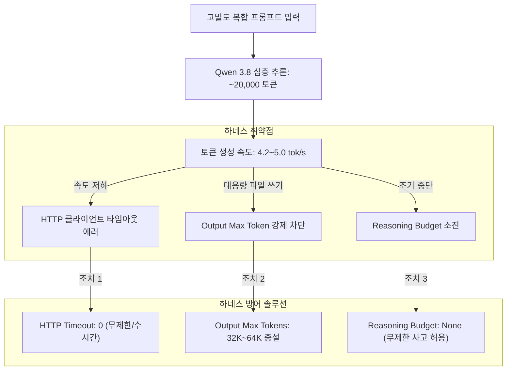

# CPU 오프로딩 비트 정렬(Bit-Packing) 역설 및 로컬 AI 하네스 타임아웃 설계

## 1. 3비트 양자화의 CPU 오프로딩 역설 (The Non-Power-of-2 Bit Alignment Penalty)
일반적으로 비트 수가 낮을수록 가중치 파일 용량이 작아져 메모리 대역폭을 덜 소모하므로 추론 속도가 빨라질 것으로 예상된다. 그러나 **GPU와 CPU가 혼합된 하이브리드 오프로딩 환경에서는 3비트(IQ3)가 4비트(IQ4)보다 현저히 느려지는 현상**이 발생한다.

### 메커니즘 분석
1. **CPU SIMD 아키텍처의 바이트 단위 처리**:
   - x86-64 CPU의 AVX2 / AVX-512 명령어 세트는 8비트(1바이트), 16비트, 32비트 단위 레지스터 정렬에 고도로 최적화되어 있다.
   - **4비트 양자화**: 1바이트에 정확히 2개의 가중치가 패킹되어 니블(Nibble) 단위로 깔끔하게 분할 및 압축 해제된다.
   - **3비트 양자화**: 바이트 경계(Byte Boundary)에 맞아떨어지지 않아 3개 가중치를 1바이트에 넣지 못하고 여러 바이트에 걸쳐 비트를 쪼개 넣어야 한다.
2. **언패킹(Unpacking) 연산 병목**:
   - CPU가 계산을 수행하기 전 비트마스킹과 시프트 연산을 통해 3비트 가중치를 디패킹해야 하며, 이 CPU 오버헤드가 메모리 절감으로 인한 이득을 완전히 상쇄하고 추론 속도를 갉아먹는다.
3. **엔지니어링 원칙**:
   - **GPU 전용**: 3비트(IQ3XXS 등)가 VRAM 절약 및 속도 유지에 유리함.
   - **CPU 대량 오프로드 혼합 환경**: 무조건 2의 거듭제곱인 **4비트(IQ4_XS, Q4_K_M)**를 선택해야 CPU SIMD 연산 효율이 극대화된다.

---

## 2. 저속 로컬 LLM 환경의 3대 하네스(Harness) 방어 수칙

### 1) HTTP 클라이언트 타임아웃 무력화
- 기본 라이브러리(Axios, Fetch, Requests)는 대개 60~120초 타임아웃을 기본값으로 가짐.
- 4 tok/s 환경에서 20,000 토큰 추론 시 응답 대기 시간만 수십 분에 달하므로 소켓 타임아웃이 발생함.
- **해결**: 클라이언트 및 프록시의 `timeout: 0` (또는 최소 10,800,000ms = 3시간) 고정.

### 2) Reasoning Budget(생각 예산) 해제
- 최근 추론형 모델(Qwen 3.8, DeepSeek-R1 등)은 복잡한 도구 호출 및 파일 생성 전 15K~30K 토큰 수준의 내부 CoT를 작성함.
- `thinking_budget`을 4K~8K로 제한하면 생각을 끝마치지 못한 채 어중간한 상태에서 도구를 호출하여 Syntax Error나 침묵 루프를 유발함.
- **해결**: 추론 예산을 완전히 해제(`budget: None`).

### 3) CPU 물리 코어 1:1 스레드 핀(Thread Pinning)
- 하이퍼스레딩(SMT) 논리 스레드까지 전부 할당하면 CPU L3 캐시 경합(Cache thrashing)으로 속도가 20~30% 급락함.
- 반드시 **물리 코어 수(Physical Core Count)**에 스레드를 고정해야 최상의 throughput을 유지함 (예: 6코어 12스레드 CPU ➔ `-t 6`).

---

## 3. 지식 연결
- 실측 출처: [[01_AI_시스템_및_도구/Qwen3.8_27B_단일_8GB_그래픽카드_실전구동_성능_분석_RedStapler]]
- 아키텍처 분석: [[02_AI_기술_위키/Qwen_3.8_27B_하이브리드_DeltaNet_아키텍처_및_VRAM_최적화]]
