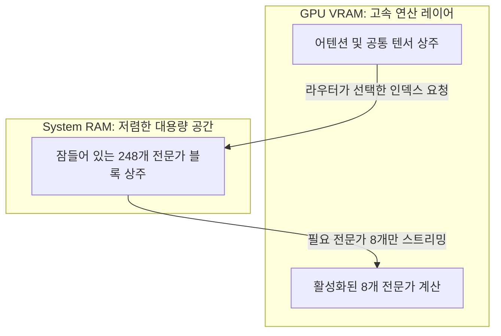

# MoE CPU 전문가 오프로딩 (--n-cpu-moe) 및 Turbo Quant 비대칭 KV 캐시 아키텍처

## 1. MoE(Mixture of Experts) 메모리 비대칭성과 텐서 핀닝 원리

전통적인 Dense 모델은 모든 토큰 연산 시 모델의 100% 가중치가 활성화되지만, MoE 모델은 **스파스(Sparse) 활성화** 특성을 가진다.

- **어텐션 & 공통 프로젝션 (Dense Backbone)**: 매 토큰마다 100% 연산 필요 ➔ **GPU VRAM 상주 필수**.
- **전문가 블록 (Expert FFNs)**: 전체 N개(예: 256개) 중 극히 일부(예: 8개)만 매 토큰마다 선택적으로 호출됨 ➔ 대다수는 유휴 상태(Dormant).

### `--n-cpu-moe <N>` 플래그 메커니즘
- 단순 `-ngl` 레이어 분할은 레이어 전체(어텐션+전문가)를 통째로 옮기므로 PCIe 버스 병목을 유발한다.
- `--n-cpu-moe`는 어텐션 백본은 전부 GPU에 남겨두고 **오직 전문가 FFN 텐서만 지정된 N개 레이어에 대해 시스템 RAM으로 격리**시킨다.
- 결과: PCIe를 오가는 데이터 크기가 레이어 전체에서 '선택된 8개 전문가' 크기로 급감하여 추론 속도가 3배 이상 폭증한다.

---

## 2. Google DeepMind Turbo Quant 비대칭 KV 캐시 원리

KV 캐시는 컨텍스트 길이 $L$에 따라 선형적으로 증가하여 장문 컨텍스트에서 VRAM OOM의 주원인이 된다.

$$M_{KV} = 2 	imes N_{layers} 	imes H_{dim} 	imes L_{ctx} 	imes B_{precision}$$

### Turbo Quant 기법의 2대 축
1. **무작위 직교 회전 (Random Orthogonal Rotation)**:
   - 어텐션 활성화 벡터에 무작위 직교 행렬을 곱해 아웃라이어(이상치) 스파이크를 전체 차원으로 균일하게 분산시킴.
   - 아웃라이어가 사라져 3~4비트의 극단적 양자화에서도 정보 손실(양자화 오차)이 극소화됨.
2. **GQA 기반 비대칭 양자화 (`--ctk turbo4 --ctv turbo3`)**:
   - GQA(Grouped Query Attention) 구조에서는 Key 캐시가 Query와의 내적 연산 정확도에 더 민감함.
   - **Keys**: 4-bit (`turbo4`)
   - **Values**: 3-bit (`turbo3`)
   - 결과: Q8과 구별 불가능한 perplexity를 유지하면서 메모리 점유율을 50% 이상 추가 절감하여 6GB GPU에서도 256K 컨텍스트 적재를 가능케 함.

---

## 3. 프로덕션 메모리 락 (`mlock`) 3계층 방어벽
운영체제 가상 메모리 관리자(VMM)는 유휴 상태의 RAM 블록을 스왑 디스크로 페이징하려는 본능이 있다.

1. **LXC Host**: 메모리 락 제한(`ulimit -l unlimited`) 허용.
2. **Docker Engine**: `--cap-add=IPC_LOCK` 컨테이너 기능 부여.
3. **llama.cpp**: `--mlock` 플래그로 할당된 가중치 버퍼에 `mlock(2)` 시스템 콜 호출.

---

## 4. 지식 연결
- 실측 분석: [[01_AI_시스템_및_도구/Qwen_35B_MoE_6GB_VRAM_초고속_17toks_256K_튜닝_Codacus]]
- 8GB 구동 실측: [[01_AI_시스템_및_도구/Qwen3.8_27B_단일_8GB_그래픽카드_실전구동_성능_분석_RedStapler]]
- 27B 아키텍처: [[02_AI_기술_위키/Qwen_3.8_27B_하이브리드_DeltaNet_아키텍처_및_VRAM_최적화]]
