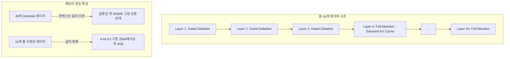

# Qwen 3.8-27B 하이브리드 DeltaNet 아키텍처 및 VRAM 최적화 원리

## 1. 개요 및 설계 철학
전통적인 트랜스포머 모델(Dense Transformer)은 컨텍스트 길이가 길어질수록 Key-Value(KV) 캐시가 $O(N)$으로 선형 증가하여, 모델 가중치보다 KV 캐시가 VRAM을 더 많이 잠식하는 메모리 병목 현상이 발생한다. 
Qwen 3.8-27B는 **Gated DeltaNet 선형 어텐션**과 **전통 풀 어텐션(Full Attention)**을 3:1 비율로 결합한 하이브리드 구조를 도입하여, 추론 정확도를 손실 없이 보존하면서 긴 컨텍스트에서의 VRAM 소요량을 획기적으로 낮춘 차세대 오픈 가중치 아키텍처다.

---

## 2. 하이브리드 어텐션(3:1 DeltaNet) 상세 제원
- **네트워크 레이어**: 총 64개 레이어
- **은닉 차원(Hidden Dimension)**: 5,120
- **어휘 집합(Vocabulary)**: 248,000 토큰
- **레이어 분할**:
  - **48개 Gated DeltaNet 레이어**: 선형 순환 모델 형태로 작동하여 고정 크기 상태 벡터(약 250MB)만 갱신.
  - **16개 풀 어텐션 레이어**: 장기 의존성(Long-range dependency) 및 정밀한 문맥 회상을 위해 전통적인 KV 캐시를 유지.
- **토큰당 KV 캐시 점유율 (16개 레이어 기준)**:
  - 16-bit FP: 토큰당 약 **64 KB**
  - 8-bit KV: 토큰당 약 **32 KB**
  - 4-bit KV: 토큰당 약 **16 KB**
  - *비교: 기존 27B 풀 어텐션 모델 대비 KV 캐시 메모리 약 75% 절감.*

---

## 3. 로컬 VRAM 수용 방정식 (Deployment Memory Budget)
로컬 GPU 배포 시 가용 VRAM($V_{avail}$)은 단순 가중치 크기가 아닌 아래 6대 요소의 합을 감당해야 한다.

$$V_{total} = W_{base} + M_{KV}(L_{ctx}, B_{kv}) + S_{DeltaNet} + C_{buffer} + O_{display} + D_{draft}$$

1. $W_{base}$ (기본 가중치): 양자화 비트 수(Q3~Q8)에 따라 8.4GB ~ 26GB.
2. $M_{KV}$ (KV 캐시): 컨텍스트 토큰 수와 KV 양자화 비트에 의해 결정 (4-bit 시 64K에 ~1GB, 256K에 ~4GB).
3. $S_{DeltaNet}$ (순환 상태): 슬롯당 약 250MB 고정.
4. $C_{buffer}$ (연산 버퍼): 활성화 텐서 및 런타임 스크래치 공간 (~1.0GB).
5. $O_{display}$ (OS 디스플레이 오버헤드): 모니터 출력 및 윈도우 DWM 점유 (약 300~800MB).
6. $D_{draft}$ (투기적 드래프트 모델): MTP 또는 Dflash v2 적용 시 추가 할당.

---

## 4. 투기적 디코딩 및 가속 기법
- **MTP (Multi-Token Prediction)**:
  - 한 스텝에 2개 이상의 미래 토큰을 동시 예측 ($n=2$).
  - RTX 3090/4090 환경에서 가중치 변경 없이 추론 스루풋을 **56% 이상 가속** (42 tok/s ➔ 65.6 tok/s).
- **Dflash 2 (Block Diffusion Speculative Drafting)**:
  - 학습 기반 블록 확산 모델을 가벼운 드래프터로 사용하여 한 번의 검증으로 다중 토큰을 대량 확정.
  - RTX 5090 환경에서 코딩 작업 기준 200~300 tok/s 돌파 가능.

---

## 5. 지식 연결
- 출처 분석: [[01_AI_시스템_및_도구/Qwen3.8_27B_모든_GPU_8GB_32GB_로컬_실행_가이드_RepoChad]]
- 하드웨어 헌법: [[GEMINI.md]]
