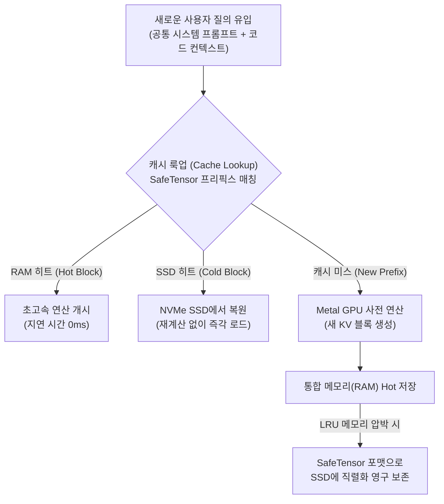

# SSD 2계층 영구 KV 캐시(Two-Tier Persistent KV Cache) 아키텍처 및 OMLX 원리

## 1. 개요 및 엔지니어링 문제의식
로컬 LLM을 코딩 에이전트나 대화형 시스템에 활용할 때 가장 심각한 레이턴시 병목은 **프롬프트 프리픽스 재계산(Prompt Prefix Recomputation)**이다. 시스템 프롬프트, 도구 정의(Tools Schema), 대규모 코드베이스 파일 등 반복적으로 주입되는 수만 토큰의 컨텍스트는 매 요청마다 다음과 같은 문제를 야기한다:
1. **극심한 첫 토큰 지연 시간 (Time to First Token, TTFT)**: 모델이 실제 답변을 시작하기 전 수십 초 동안 수식 계산 대기.
2. **휘발성 캐시의 한계**: 전통적인 런타임(Ollama, LM Studio)은 프로세스를 재시작하거나 컨텍스트가 초과되면 KV 캐시를 메모리에서 즉시 폐기.
3. **RAM 용량 압박**: 긴 컨텍스트(256K 등)를 유지하려면 모델 가중치보다 훨씬 많은 양의 VRAM/RAM이 KV 캐시로 소비됨.

`OMLX`는 이를 해결하기 위해 Apple Silicon 환경에서 **초고속 SSD를 활용한 2계층 영구 KV 캐시 아키텍처**를 구현했다.

---

## 2. SSD 2계층 영구 캐시 아키텍처

### 1) Hot & Cold 계층 분리
- **Hot Tier (통합 메모리/VRAM)**: 가장 최근에 참조된(MRU) 활성 대화 및 최근 세션의 KV 캐시를 상주시킴.
- **Cold Tier (NVMe SSD)**: 메모리 한도에 도달하면 LRU(Least Recently Used) 알고리즘에 따라 이전 대화 블록을 SSD의 지정된 영구 스토리지로 덤프.

### 2) SafeTensor 직렬화 및 영구 복원
- KV 캐시 블록을 표준적이고 안전한 `SafeTensors` 바이너리 형식으로 디스크에 기록.
- **영구 보존성**: OMLX 서버 데몬을 재시작하거나 PC를 재부팅해도 캐시 인덱스가 유지되어, 기존 프로젝트 세션을 다시 열었을 때 콜드 스타트 지연 없이 즉시 초고속 추론 상태로 진입.

---

## 3. 로컬 런타임 비교 분석 매트릭스

| 평가 항목 | OMLX (Apple Silicon) | LM Studio | Ollama (공식) | llama.cpp (CLI) |
| :--- | :--- | :--- | :--- | :--- |
| **코어 백엔드** | Apple `mlx-lm` 네이티브 | llama.cpp 기반 래퍼 | llama.cpp 포크 | 순수 C/C++ llama.cpp |
| **KV 캐시 영구화** | **지원 (SSD SafeTensors)** | 미지원 (메모리 휘발) | 부분 지원 (임시 캐시) | 지원 (`--prompt-cache`) |
| **메모리 오버헤드** | 극도로 낮음 (경량 데몬) | 높음 (Electron UI 비대) | 낮음 (Go 데몬) | 제로 (순수 CLI) |
| **에이전트 모델 최적화** | **MoE 8-bit 특화 로드** | GGUF 중심 | GGUF 중심 | GGUF 정밀 제어 |
| **원격 네트워크 연동** | 표준 OpenAI API + Tailscale | 로컬 서버 모드 | 로컬 포트 바인딩 | 내장 HTTP 서버 |

---

## 4. 코딩 에이전트 환경에서의 실전 함의: Claude Code vs Open Code

Samuel Gregory의 실측 결과, 로컬 LLM을 에이전트 하네스에 결합할 때 다음과 같은 도구별 거동 차이가 확인되었다:

1. **Claude Code의 'Context Blowing' 현상**:
   - 방대한 툴 정의와 장황한 시스템 프롬프트를 공격적으로 컨텍스트에 쏟아붓는 경향이 있어, 로컬 32GB~64GB 머신에서는 순식간에 컨텍스트 한계(Context Limit)에 도달함.
2. **Open Code 및 Aider의 우수성**:
   - 컨텍스트를 정밀하게 압축하고 변경된 델타(Diff) 위주로 전송하여 토큰 소비를 최소화함.
   - OMLX의 영구 KV 캐시와 결합했을 때 토큰 낭비 없이 안정적인 장기 코딩 세션을 유지할 수 있음.

---

## 5. 전일도 3-PC 아키텍처 및 윈도우 환경 적용 방안

1. **메인 데스크톱 (RX 6600 8GB VRAM + Ryzen 5600X)**:
   - 윈도우/x86 환경에서는 OMLX를 직접 실행할 수 없으나, `llama.cpp` 또는 `vLLM`의 `--prompt-cache-all` 플래그 및 SSD 스왑을 구성하여 동일한 2계층 영구 캐시 효과를 달성할 수 있음.
   - 사용자 공통 헌법(`GEMINI.md`)과 전역 스킬 템플릿을 캐시 파일(`.cache`)로 고정하여 추론 지연 제거.
2. **Tailscale 기반 분산 추론망**:
   - 데스크톱의 로컬 추론 포트를 Tailscale로 바인딩하여 서브 노트북(Dell Latitude 7440)에서 원격 호출.

---

## 🔗 관련 개념
- [[Mac_로컬_AI_종결자_OMLX_및_SSD_2계층_KV캐시_완전분석_SamuelGregory]]
- [[하네스_우위의_법칙_Harness_Beats_the_Tier_및_VRAM_엔지니어링]]
- [[8GB_GPU_코딩_워크벤치_4대_툴_체계_및_리듬_보존_원칙]]
- [[MoE_CPU_전문가_오프로딩_및_TurboQuant_KV_캐시_아키텍처]]
