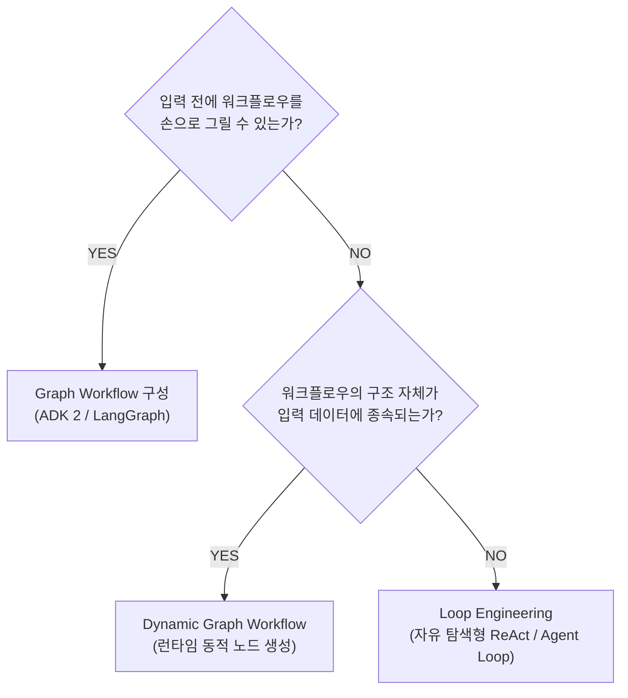

# 그래프 엔지니어링 (Graph Engineering) 및 Google ADK 2 3대 핵심 아키텍처 패턴

## 1. 개념 및 엔지니어링 계층
AI 시스템 엔지니어링은 복잡도를 통제하기 위해 4단계로 진화해 왔다.

| 계층 | 명칭 | 핵심 질문 | 통제 대상 | 한계점 |
| :---: | :--- | :--- | :--- | :--- |
| **L1** | Prompt Engineering | "모델에게 어떻게 말할까?" | 단일 인스트럭션 | 복합 작업 시 환각 및 통제 불능 |
| **L2** | Context Engineering | "모델 주변에 무엇을 둘까?" | RAG, 시스템 프롬프트, 도구 스키마 | 토큰 팽창 및 문맥 오염 |
| **L3** | Loop Engineering | "어떻게 계획-실행-검증 순환을 돌릴까?" | ReAct 루프, 자기 수정(Reflection) | 무한 루프, 탈출 실패, 비용 누수 |
| **L4** | **Graph Engineering** | **"어떻게 결정론적 코드와 에이전트를 배선할까?"** | **노드(함수/LLM) + 엣지(데이터 흐름)** | 사전 구조 설계 필요 |

> **골든 룰**: *"Predictable work goes in functions, reasoning goes in the model."*  
> 예측 가능한 팩트 수집, 포맷 변환, 조건 분기는 파이썬 함수로 처리하고, 비정형 데이터의 종합 추론만 LLM에 위임한다.

---

## 2. ADK 2 3대 핵심 그래프 패턴

### 1) 팬아웃 (Fan-Out): 병렬 실행
- 독립적인 데이터 의존성을 가진 노드들을 비동기 병렬로 동시 발주.
- **정적 팬아웃(Static)**: 사전에 정의된 N개 소스 동시 호출 (예: 날씨, 코스, 체력 동시 수집).
- **동적 팬아웃(Dynamic)**: 런타임 검색 결과나 리스트 크기에 따라 런타임에 서브 그래프를 가변 생성.

### 2) 조인 노드 (Join Node): 무비용 합성기
- 병렬 브랜치들의 완료를 대기(Barrier Synchronization)하고, 각 노드의 출력을 노드명을 키로 하는 단일 구조체(Dictionary)로 묶음.
- LLM 취합 에이전트가 필요 없으므로 **지연 시간과 토큰 비용이 0**이다.

### 3) 라우터 패턴 (Router Pattern): 결정론적 vs 확률론적 분기
- **Deterministic Router (우선 권장)**:
  - 데이터 내부에 임계값(Threshold), 상태 플래그, 파일 타입 등 명확한 신호가 존재하는 닫힌 도메인(Closed Set).
  - 파이썬 `if/elif/else` 문으로 라우팅 ➔ 비용 $0, 지연 시간 0ms, 신뢰도 100%.
- **LLM Classifier Router (폴백)**:
  - 신호가 모호한 자유 자연어 입력(Open Set)에서 의도를 분류할 때만 제한적으로 사용.

---

## 3. 그래프 도입 판별 알고리즘 (Decision Heuristic)

---

## 4. 지식 연결
- 원본 분석: [[01_AI_시스템_및_도구/Google_ADK2_기반_그래프_엔지니어링_완전정복_GoogleCloudTech]]
- 시스템 헌법: [[GEMINI.md]]
