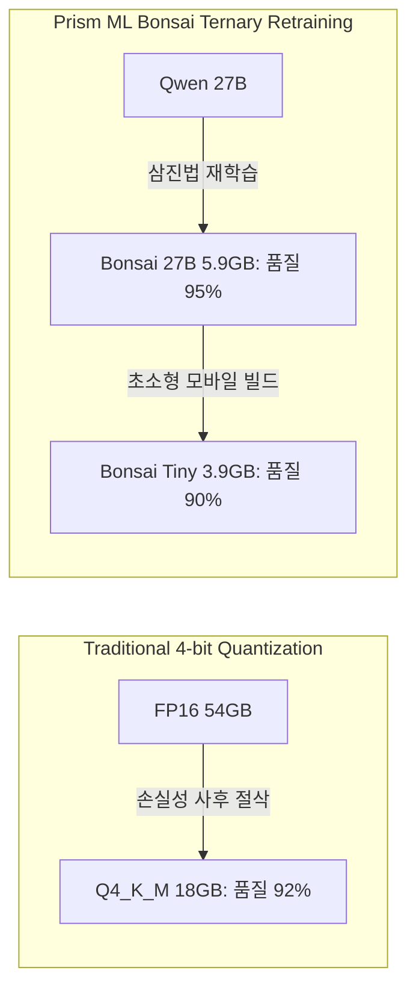

# 루프드 트랜스포머 (Looped Transformer) 및 1.58비트 터너리(Ternary) 초압축 원리

## 1. 루프드 트랜스포머 (Looped Transformer: Nanbeige 4.2 방식)

전통적인 트랜스포머는 모델 용량과 지능을 높이기 위해 레이어를 수직으로 적층(Stacking)하여 파라미터 수와 VRAM 소요량이 선형 비례한다.

- **원리**: 레이어를 새로 추가하지 않고, **기존에 존재하는 $N$개의 레이어를 토큰 생성 과정에서 $K$번 재순환(Recurrent Loop)**시켜 연산을 심화한다.
- **수학적 모델**:
  $$h_{t}^{(k)} = 	ext{LayerBlock}\left(h_{t}^{(k-1)}, 	ext{State}
ight) \quad (k = 1, \dots, K)$$
- **효과**:
  - 메모리에는 $N$개 레이어 가중치(예: 3B 크기, 약 2GB)만 유지.
  - 실제 유효 연산 깊이는 $N 	imes K$에 달하여 9B~12B급의 복합 추론과 63% SWE-Bench 해결력을 달성함.

---

## 2. 1.58비트 삼진법(Ternary) 재학습 압축 (Bonsai 방식)

사후 양자화(PTQ)의 한계를 극복하기 위해 가중치를 3진법으로 제약하여 재학습하는 패러다임이다.

$$\mathbf{W} \in \{-1, 0, +1\}^{d_{out} 	imes d_{in}}$$

### 압축 메커니즘
1. **비트 패킹**: 3개의 가중치($3^3 = 27$)를 5비트($2^5 = 32$)에 패킹하거나, 1.58비트 부호-절댓값 구조로 인코딩.
2. **행렬 곱 연산의 덧셈 변환**: 곱셈기(Multiplier)가 필요 없고 부호 반전과 덧셈(Accumulation)만으로 연산되므로 하드웨어 실행 속도가 폭증함.
3. **지능 밀도**: 27B 파라미터의 구조적 연결성을 보존하면서 VRAM을 5.9GB(품질형) / 3.9GB(모바일형)로 압축하여 8GB GPU와 스마트폰에 수용.

---

## 3. 지식 연결
- 실측 분석: [[01_AI_시스템_및_도구/2026_GPU_체급별_로컬_AI_신기술_5대_티어_분석_Kai]]
- 8GB 티어리스트: [[01_AI_시스템_및_도구/2026_VRAM_체급별_최고의_로컬_AI_티어리스트_및_하네스의_법칙_CloudCodes]]
- 헌법: [[GEMINI.md]]
