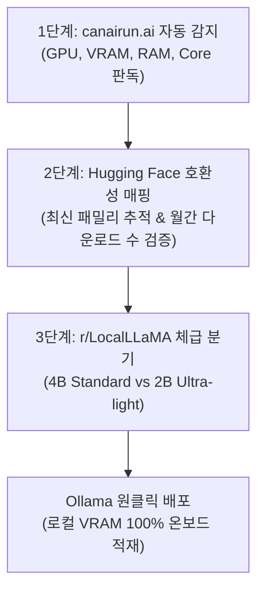

# 무검열(Uncensored) 로컬 LLM 하드웨어 매칭 파이프라인 및 가드레일 해제 모델 운영 아키텍처

## 1. 개요 및 설계 목적
상용 클라우드 AI 서비스(OpenAI ChatGPT, Anthropic Claude, Google Gemini 등)는 RLHF(인간 피드백 강화학습)와 시스템 레벨 정렬(Alignment)을 통해 강력한 안전 가드레일을 적용한다. 그러나 이러한 검열 정책은 화이트햇 모의해킹(침투 테스트), 보안 취약점 연구, 가차 없는 사실 검증, 특정 창작 분야에서 불필요한 거부 응답(Refusals)을 유발한다.

본 문서는 **소비자용 저사양 하드웨어(4GB~8GB VRAM 및 Apple Silicon M1/M2)**에서 병목 없이 구동 가능한 무검열 모델을 선별하는 3단계 하드웨어 매칭 파이프라인과, 추론(Thinking) 능력을 내장한 초경량 무검열 모델(Gemma 4 4B/2B Uncensored)의 안전하고 효과적인 로컬 운영 아키텍처를 정의한다.

---

## 2. 하드웨어-모델 3단계 매칭 파이프라인

### 1) Step 1: 자동 하드웨어 핑거프린팅 (`canairun.ai`)
- 브라우저 기반 WebGL 및 시스템 쿼리를 통해 로컬 장치의 VRAM 한계선, 시스템 메모리 총량, GPU 컴퓨트 유닛을 즉시 측정.
- 코딩, 이미지, 영상, 경량 텍스트 카테고리별 허용 가능한 파라미터 상한선(Parameter Ceiling) 도출.

### 2) Step 2: 레지스트리 교차 검증 (Hugging Face)
- 정적 디렉토리가 추천하는 구형 베이스라인(예: Gemma 3 4B)을 기반으로, 최신 정렬 해제 파인튜닝 가중치(Gemma 4 Uncensored) 검색.
- 월간 다운로드 수(200만~250만 회 이상) 및 토론 스레드를 분석하여 환각(Hallucination) 및 가중치 훼손 여부 사전 필터링.

### 3) Step 3: 체급별 최적 분기 및 Ollama 배포
- **4B 체급 (약 5~6GB 점유)**: 8GB 외장 GPU(AMD RX 6600, RTX 3050/4060) 또는 Apple Silicon M2 Pro/M3 이상.
- **2B 체급 (약 2~3GB 점유)**: 기본 M1 맥북(8GB 통합 메모리) 및 보급형 노트북(Intel Iris Xe 내장 그래픽).

---

## 3. Gemma 4 Uncensored의 핵심 기술적 특성

### 1) 사고 추론(Thinking Block) 결합
- 과거의 무검열 모델들이 단순 가드레일 삭제(Abliteration)에 치중하여 지능과 논리력이 붕괴되었던 것과 달리, Gemma 4 Uncensored는 `<think>` 블록 기반의 체계적 추론 능력을 유지함.
- 복잡한 수식, 알고리즘, 취약점 공격 벡터 설계 시 다단계 논리 검증을 거쳐 최종 결과를 생성.

### 2) 거부율 제로 (Zero Refusal Rate)
- 시스템 프롬프트나 입력 질의에 대한 안전 필터링이 비활성화되어, 보안 분석가나 연구자가 요청한 페이로드(Payload), 익스플로잇 구조, 취약점 진단 스크립트를 설교나 거부 없이 즉시 반환.

---

## 4. 3-PC 운영 격리 및 가드레일 이원화 매트릭스

| 장비 프로파일 | 할당 모델 체급 | 구동 방식 | 주 용도 | 보안 격리 수준 |
| :--- | :--- | :--- | :--- | :--- |
| **메인 본체 (Desktop: RX 6600 8GB)** | **Gemma 4 4B Uncensored** | VRAM 100% 온보드 (Ollama) | 보안 스크립트 작성, 모의 침투 페이로드 분석, 무제한 브레인스토밍 | 완전 로컬 오프라인 격리 (외부망 차단 권장) |
| **서브 노트북 (Laptop: Latitude 7440)** | **Gemma 4 2B Uncensored** | RAM/iGPU 저전력 구동 (Ollama) | 이동 중 비공개 코드 감사, 필터링 없는 텍스트 정제 | 로컬 암호화 볼트 내 실행 |
| **학원 실습 PC (Academy PC)** | **설치 금지 (차단)** | - | 공용 환경 무검열 모델 구동 원천 금지 | 격리 정책 준수 |

---

## 5. 엔지니어링 체크리스트 및 주의 사항
1. **역할 분리 (Role Separation)**:
   - 무검열 모델을 프로덕션 배포용 코드 작성의 메인 드라이버로 단독 사용하지 않는다. (코딩 전용 정밀 모델인 `Qwen 2.5 Coder 7B` 또는 `Antigravity Gemini`가 구문 완성도와 안정성 면에서 우위).
   - 거절 필터링이 방해되는 보안 진단, 취약점 코드 역분석, 창작 시나리오에 핀셋 투입한다.
2. **네트워크 격리 및 데이터 보호**:
   - 무검열 모델이 생성한 원시 익스플로잇 코드는 프로덕션 환경에 직접 실행하지 않고, 격리된 가상 샌드박스 환경에서만 검증한다.
3. **메모리 오프로드 누수 방지**:
   - 8GB VRAM 카드에서는 4B 모델을 초과하는 14B~27B 무검열 모델을 무리하게 로드하지 않는다. (CPU 오프로드로 인한 토큰 속도 급락 방지).

---

## 🔗 관련 개념
- [[저사양_PC_맥북_무검열_AI_선별_및_Gemma4_구동_가이드_MarkGadalaMaria]]
- [[8GB_VRAM_최고의_로컬_코딩_AI_5종_실측_벤치마크_RedStapler]]
- [[2026_GPU_체급별_로컬_AI_신기술_5대_티어_분석_Kai]]
- [[하네스_우위의_법칙_Harness_Beats_the_Tier_및_VRAM_엔지니어링]]
