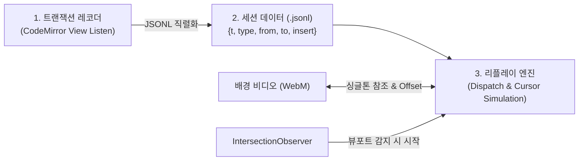

# 🖥️ 인터랙티브 에디터 리플레이 아키텍처 (JSONL + CodeMirror)

웹 애플리케이션 랜딩페이지나 제품 쇼케이스에서 사전 녹화된 동영상/GIF 대신, **실제 동작하는 웹 에디터 위에서 사용자의 과거 타이핑 세션을 밀리초 단위로 재생하는 아키텍처**.

방문자는 가짜 이미지가 아닌 실제 에디터 환경을 즉각 체감할 수 있으며, 재생 도중이나 직후 언제든 직접 키를 입력하거나 수정할 수 있다.

---

## 🏗️ 4대 핵심 구성 요소

### 1. 트랜잭션 레코더 (Session Recorder)
- 에디터 내의 모든 변경(삽입, 삭제, 커서 이동, 범위 선택) 이벤트를 감지한다.
- 각 트랜잭션마다 상대 시간 타임스탬프(`timestamp_ms`)와 변경 내용(`changes`, `selection`)을 직렬화한다.
- **JSONL 포맷 활용**: 라인 단위 분리가 가능한 JSONL을 사용해 대용량 세션 스트림을 경량화하고 안전하게 파싱한다.

### 2. 브라우저 메모리 기반 익스포트 파이프라인
- 별도의 원격 서버나 DB 연동 없이 브라우저 메모리 상에서 `new Blob([jsonlData], { type: 'text/plain' })`을 생성한다.
- 가상 앵커 태그(`<a>`)를 생성하고 프로그래밍 방식으로 클릭(`anchor.click()`)을 유도해 로컬 파일로 즉시 다운로드한다.

### 3. 정밀 리플레이 엔진 (Replay Engine)
- 직렬화된 JSONL 데이터를 읽어들여 타이머(`setTimeout` 또는 `requestAnimationFrame`) 스케줄링으로 CodeMirror `dispatch`를 실행한다.
- **포커스 없는 커서 표시**: 에디터가 활성화(Focus)되지 않은 상태에서도 커서가 자연스럽게 깜빡이도록 CSS 커스텀 처리를 적용한다.
- **지연 렌더링 최적화**: `IntersectionObserver`를 연결해 사용자가 해당 섹션에 도달하기 전에는 연산을 중단하고, 뷰포트 내 진입 시에만 재생을 가동하여 브라우저 부하를 0으로 유지한다.

### 4. 미디어-에디터 싱글톤 동기화 (Media-DOM Sync)
- 실제 키보드를 두드리는 배경 영상(WebM)과 화면 상의 타이핑 트랜잭션을 1:1로 맞춘다.
- 비디오 DOM 요소를 싱글톤 참조 모듈에 등록하고, 정밀 오프셋(offset 밀리초) 값을 적용해 영상 속 타건 동작과 텍스트 출력을 동기화한다.

---

## 💡 주요 장점 및 적용처
- **제품 체험 장벽 제거**: 앱 다운로드 없이 웹 랜딩페이지에서 네이티브 수준의 UX를 직접 경험하게 함.
- **데이터 다이어트**: 무거운 고용량 비디오 전체를 로딩하는 대신 텍스트 기반 JSONL(수십 KB)로 복잡한 타이핑 과정을 경량 전송.
- **인터랙션 인계**: 리플레이 완료 후 사용자가 마우스를 올리거나 키보드를 칠 때 즉시 실제 에디터 모드로 전환 가능.

---

## 🔗 출처 및 연관 문서
- 출처 분석 노트: [[How_to_build_a_self-typing_editor_demo_with_Waku_CodeMirror_devaslife]]
