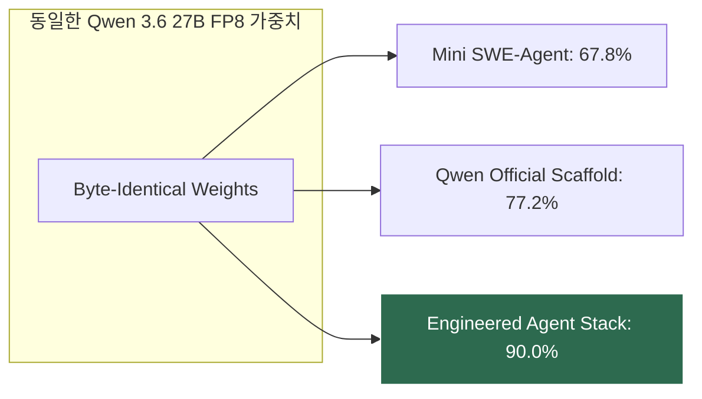

# 하네스 우위의 법칙 (The Harness Beats the Tier) 및 VRAM 엔지니어링 원리

## 1. 하네스 우위의 법칙 (The Harness Beats the Tier)

동일한 인공지능 모델 가중치(Byte-Identical Weights)를 사용하더라도, 모델을 둘러싼 **소프트웨어 하네스(Scaffold, Context, Tool Interface, Loop)**의 정밀도에 따라 실전 벤치마크 결과가 극적으로 변동한다.

$$\Delta 	ext{Capability}_{	ext{Harness}} \gg \Delta 	ext{Capability}_{	ext{Hardware Tier}}$$

### SWE-Bench Verified 실측 근거 (M Erju O, 2026.05)
- **Scaffold 1 (Mini SWE-Agent)**: 67.8% (단순 ReAct 루프)
- **Scaffold 2 (Qwen Official)**: 77.2% (+9.4%p, 모델 카드 공식 기록)
- **Scaffold 3 (Engineered Stack)**: **90.0% (+22.2%p, 엄격 필터링 시 88.0%)**
- **아키텍처 시사점**: 하드웨어 티어를 한 단계 올려서 얻는 성능 개선폭보다, **하네스의 도구 피드백 루프와 문맥 압축, 결정론적 라우터를 튜닝해서 얻는 성능 개선폭(+22.2점)이 압도적으로 크다**.

---

## 2. 엄밀한 로컬 VRAM 수용 방정식 (VRAM Sizing Formula)

단순 모델 가중치 파일 크기만 보고 VRAM을 계산하면 100% OOM이 발생한다.

$$V_{	ext{req}} = \left( P_{	ext{total}} 	imes B_{	ext{quant}} 	imes 0.125 
ight) + M_{	ext{KV}}(L_{	ext{ctx}}, B_{	ext{kv}}) + M_{	ext{runtime}}$$

1. **가중치 점유율**:
   - `Q4_K_M` 기준 약 4.8 bits/weight ➔ **1B 파라미터당 약 0.6 GB**.
2. **KV 캐시 오버헤드**:
   - 컨텍스트 토큰 길이 $L_{	ext{ctx}}$에 비례하여 선형 증가.
   - 8K 컨텍스트 기준 통상 1.0~1.5 GB.
3. **런타임 및 OS 버퍼**:
   - 디스플레이 출력(DWM), CUDA/ROCm 컨텍스트 ➔ 약 0.5~1.0 GB.

### 2026 VRAM 체급별 최적 가이드
- **4 GB**: 3B~4B 초경량 모델 (`Phi-4 Mini 3.8B`, `Gemma 4 E4B`)
- **8 GB**: 8B~9B 고밀도 모델 (`Qwen 3.5 9B`, `Qwen 2.5 Coder 7B`)
- **16 GB**: MoE 기반 희소 모델 (`Qwen 3.6 35B A3B` ➔ 100 tok/s)
- **24 GB**: 단일 카드 최강 덴스 모델 (`Qwen 3.6 27B Dense`)

---

## 3. 지식 연결
- 실측 분석: [[01_AI_시스템_및_도구/2026_VRAM_체급별_최고의_로컬_AI_티어리스트_및_하네스의_법칙_CloudCodes]]
- 8GB 코딩 최적화: [[01_AI_시스템_및_도구/8GB_VRAM_실전_로컬_코딩_AI_최종_선정_가이드_CodingHorizon]]
- 그래프 엔지니어링: [[02_AI_기술_위키/그래프_엔지니어링_Graph_Engineering_및_ADK2_3대_패턴]]
