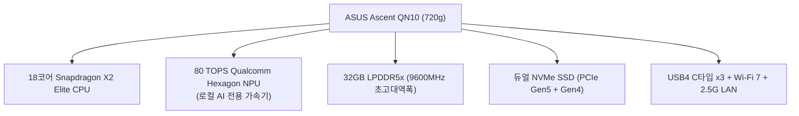

# 🖥️ ASUS Ascent QN10 (세계 최초 80 TOPS AI 미니 PC)

> **📌 아카이빙 메타데이터**
> - **원본 출처**: [YouTube (https://youtu.be/mYmXNb9U3T0)](https://youtu.be/mYmXNb9U3T0)
> - **출처 정보 발행일자**: `2026-08-13`
> - **내 보관소 등록일자**: `2026-08-14`
> - **개요**: ASUS가 컴퓨텍스 2026에서 공개한 **세계 최초의 퀄컴 스냅드래곤 X2 엘리트(Snapdragon X2 Elite) 기반 차세대 AI 미니 PC**입니다. 클라우드 연결 없이도 내장된 **80 TOPS NPU**로 온디바이스 로컬 AI(Ollama, Hermes, OpenCode 등)를 초고속 구동하는 괴물급 컴팩트 머신입니다.

---

## 📊 ASUS Ascent QN10 핵심 스펙 총정리

---

## ⚡ 주요 하드웨어 상세 사양

| 부품 / 사양 | 세부 스펙 및 특징 |
| :--- | :--- |
| **프로세서 (CPU)** | **Qualcomm Snapdragon X2 Elite (18코어 3세대 Oryon CPU)** (M4 Mac mini를 정조준한 초고성능 저전력 ARM 프로세서) |
| **AI 연산장치 (NPU)** | **80 TOPS Qualcomm Hexagon NPU ⭐** (현존 미니 PC 중 최강의 로컬 온디바이스 AI 연산 능력) |
| **메모리 (RAM)** | **32GB LPDDR5x (9600MHz 초고클럭 온보드)** (LLM 모델 로딩 및 고속 토큰 생성에 최적화) |
| **저장장치 (SSD)** | **듀얼 M.2 2280 슬롯** (PCIe 5.0 1개 + PCIe 4.0 1개 / 최대 4TB 확장) |
| **그래픽 (GPU)** | Qualcomm Adreno X2-90 내장 그래픽 |
| **디스플레이 출력** | **쿼드 4K@60Hz 모니터 4대 동시 출력 지원** (HDMI 2.1 + USB4 DP) |
| **네트워크 & 포트** | **Wi-Fi 7**, 블루투스 5.4, 2.5G 유선 랜, **USB4 Type-C 3개**, USB 3.2 3개 |
| **크기 & 무게** | 130 x 130 x 40 mm (손바닥 크기) / **720g** |

---

## 💡 왜 이 제품이 AI 개발자들에게 혁신적인가?

1. **80 TOPS 괴물 NPU로 로컬 AI 완전 정복**:
   * 외부 인터넷이나 유료 API 없이도 내 방 안에서 **Ollama 로컬 모델, 코딩 에이전트(OpenCode, Cursor), 비서 AI를 실시간 초고속으로 자급자족** 구동 가능.
2. **압도적인 9600MHz 램 대역폭**:
   * 로컬 AI 모델의 응답 속도(TPS)를 결정짓는 핵심인 메모리 클럭이 9600MHz에 달해 로컬 토큰 생성 속도가 폭증.
3. **저전력 24시간 홈서버/작업용 최적**:
   * ARM 아키텍처 기반이라 전기를 거의 먹지 않으면서도 발열과 소음이 거의 없어 24시간 상시 켜두는 AI 개인 서버로 완성형.

---

## 🔗 관련 문서 링크
- [[02_PC_및_시스템_환경/PC_시스템_및_하드웨어_종합_가이드|PC 시스템 종합 가이드]]
- [[01_AI_시스템_및_도구/herdr_AI에이전트_전용_터미널_멀티플렉서_완벽_가이드|herdr 멀티플렉서 가이드]]
- [[인덱스]]

## 관련
- [[노트북_구매_후보_비교_및_아카이브]]
- [[PC_시스템_및_하드웨어_종합_가이드]]
