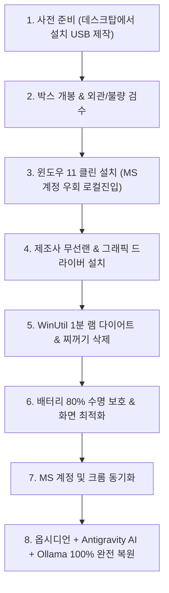

# 💻 새 노트북 언박싱부터 윈도우 11 클린 설치 & 최적화 완벽 매뉴얼

> **📌 아카이빙 메타데이터**
> - **원본 출처**: 전일도 데스크탑 100% 완전 미러링 프로토콜
> - **정보 확정일자**: `2026-08-14`
> - **내 보관소 등록일자**: `2026-08-14`
> - **개요**: 새 노트북(Free DOS 또는 윈도우 포함 모델)을 수령했을 때 **박스 개봉부터 윈도우 클린 설치, 드라이버 세팅, 램 1.2GB 다이어트, MS 계정 연동, 옵시디언 100% 복원, Antigravity AI 및 Ollama 로컬 세팅까지** 현재 데스크탑 컴퓨터 환경을 그대로 새 노트북에 10분 만에 완벽 복제(미러링)하는 마스터 프로토콜입니다.

---

## 📋 전체 작업 흐름도 (8단계 올인원 로드맵)



---

## 🛠️ 1단계: 구매 직후 사전 준비 (현재 데스크탑에서 5분 작업)

노트북이 배송 오기 전, 현재 쓰고 있는 데스크탑에서 **설치 USB**를 미리 만들어 둡니다.

1. **준비물**: 8GB 이상 용량의 남는 USB 메모리 1개
2. **다이어트 윈도우 11 설치 USB 제작 (Rufus 또는 WinUtil)**:
   * 마이크로소프트 공식 윈도우 11 ISO를 다운로드합니다.
   * [Rufus 공식 사이트](https://rufus.ie)에서 Rufus를 실행하고 USB를 굽습니다.
   * **필수 체크 옵션**:
     * `MS 계정 강제 로그인 우회 (로컬 계정 생성)` 체크
     * `TPM 2.0 및 4GB RAM 제한 해제` 체크
3. **⚠️ 필수 꿀팁 (무선랜 드라이버 USB에 미리 넣기)**:
   * 최신 노트북은 윈도우를 깔았을 때 와이파이가 바로 안 잡히는 경우가 많습니다.
   * 구매한 노트북 제조사(레노버/ASUS/HP) 고객지원 사이트에서 **무선랜(Wi-Fi) 드라이버 설치 파일**을 다운받아 설치 USB 구석에 미리 복사해 둡니다.

---

## 📦 2단계: 노트북 박스 개봉 & 초기 불량 검수 (3분)

박스를 뜯고 전원을 켜기 전, 1차 외관 불량을 점검합니다.

1. **외관 및 힌지**: 상판/하판 긁힘, 찌그러짐, 힌지 여닫을 때 삐걱거림 확인
2. **키보드 & 터치패드**: 키가 눌려있거나 터치패드 클릭 유격이 비정상적인지 확인
3. **포트류**: C타입, USB 포트 안쪽 핀 휨 여부 확인
4. **전원 연결**: 기본 제공된 충전기를 꽂고 충전 LED에 불이 정상적으로 들어오는지 확인

---

## 💿 3단계: BIOS 부팅 & 윈도우 11 클린 설치 (10분)

1. **USB 꽂고 부팅**:
   * 제작한 윈도우 설치 USB를 노트북에 꽂고 전원 버튼을 누릅니다.
   * 전원이 켜지자마자 부팅 메뉴 단축키를 연타합니다:
     * **레노버**: `F12` (또는 전원 옆 노보 버튼)
     * **ASUS**: `F8` 또는 `ESC`
     * **HP**: `F9`
2. **설치 진행**:
   * 부팅 목록에서 USB를 선택해 윈도우 11 설치 화면으로 진입합니다.
   * `지금 설치` ➔ `제품 키가 없음` 선택 ➔ `Windows 11 Home` 또는 `Pro` 선택
   * 설치 유형: **`사용자 지정: Windows만 설치(고급)`** 클릭
   * 디스크 파티션이 나오면 기존 파티션들을 모두 `삭제`하여 `할당되지 않은 공간` 하나로 만든 뒤 `다음` 클릭
3. **초기 설정(OOBE) 와이파이 연결 건너뛰기**:
   * *"네트워크에 연결"* 화면에서 와이파이가 안 잡히거나 넘어가기 힘들 때는:
     * 키보드 **`Shift + F10`**을 눌러 검은색 명령 프롬프트 창을 엽니다.
     * **`OOBE\BYPASSNRO`** 를 입력하고 엔터를 치면 노트북이 재부팅됩니다.
     * 재부팅 후 **"인터넷에 연결되어 있지 않음"** ➔ **"제한된 설치로 계속"**을 눌러 로컬 계정(예: `il-do`)으로 바로 윈도우 바탕화면에 진입합니다.

---

## 🌐 4단계: 제조사 공식 드라이버 & 업데이트 설치 (5분)

1. **와이파이 잡기**:
   * 1단계에서 USB에 미리 담아둔 **무선랜 드라이버**를 실행해 와이파이를 연결합니다.
2. **제조사 전용 관리 소프트웨어 설치**:
   * **레노버**: 마이크로소프트 스토어에서 `Lenovo Vantage` 설치
   * **ASUS**: `MyASUS` 또는 `Armoury Crate` 설치
   * **HP**: `HP Support Assistant` 설치
3. 위 프로그램을 열고 **[시스템 업데이트 / 드라이버 일괄 설치]**를 눌러 그래픽, 칩셋, 오디오 드라이버를 최신으로 자동 업데이트합니다.

---

## ⚡ 5단계: WinUtil 1분 램 다이어트 & 찌꺼기 삭제 (1분)

윈도우 11 기본 상태의 날씨 위젯(램 1.2GB 누수), 텔레메트리 감시, 불필요한 번들 앱을 1초 만에 날려버립니다.

1. 윈도우 시작 버튼 우클릭 ➔ **`터미널(관리자)`** 또는 **`PowerShell(관리자)`** 실행
2. 아래 명령어를 그대로 복사해서 붙여넣고 엔터:
   ```powershell
   irm "https://christitus.com/win" | iex
   ```
3. WinUtil 창이 뜨면:
   * 상단 **`Tweaks`** 탭 클릭
   * 우측 프리셋 중 **`Laptop`** 버튼 클릭
   * 우측 하단 **`Run Tweaks`** 클릭
   * 30초 만에 찌꺼기 앱 및 백그라운드 서비스가 정리되고 램 1.2GB가 즉시 확보됩니다.

---

## 🔋 6단계: 노트북 수명 2배 늘리는 필수 하드웨어 세팅

#### 1. 배터리 80% 충전 제한 (배터리 수명 보호 필수)
* 충전기를 상시 꽂고 쓸 때 100% 완충 상태가 유지되면 배터리가 부풀거나(스웰링) 수명이 급감합니다.
* **설정 방법**:
  * **레노버**: `Lenovo Vantage` ➔ `전원` ➔ **`보존 모드(Conservation Mode)` 켬** (75~80%에서 충전 자동 중단)
  * **ASUS**: `MyASUS` ➔ `배터리 헬스 차징` ➔ **`80% 균형 모드` 선택**
  * **HP**: BIOS 설정 진입 ➔ `Battery Care Function` ➔ **`80% 제한` 선택**

#### 2. 디스플레이 화면 비율 및 주사율 맞춤
* 바탕화면 우클릭 ➔ `디스플레이 설정`:
  * **배율**: 15~16인치 기준 **`125%`** 권장 (글자가 시원하고 선명해짐)
  * **주사율**: `고급 디스플레이` ➔ `새로 고침 빈도`를 **`120Hz` 또는 `144Hz`**로 설정하여 부드러운 화면 활성화

---

## 🔑 7단계: MS 계정 연동 & 브라우저 북마크 즉시 복원

1. **마이크로소프트 계정 로그인 (`ildochun@gmail.com`)**:
   * `Windows 설정(Win + I)` ➔ `계정` ➔ `사용자 정보` ➔ **`Microsoft 계정으로 로그인`**
   * 로그인 완료 시 기존에 보유한 디지털 정품 라이선스 및 MS 스토어 구매 내역이 자동 연동됩니다.
2. **구글 크롬 / 엣지 동기화**:
   * 크롬 브라우저를 설치하고 구글 계정 로그인 ➔ 북마크, 비밀번호, 확장 프로그램 1초 자동 복원.

---

## 🚀 8단계: 옵시디언 & Antigravity AI & Ollama 100% 완벽 복제

현재 데스크탑의 모든 AI 도구, 스킬, 옵시디언 지식 보관소를 새 노트북에 그대로 미러링합니다.

### 1. 학원/새 PC 1분 자동 설치 스크립트 실행 (원클릭)
PowerShell을 관리자 권한으로 열고 한 줄 실행:
```powershell
Set-ExecutionPolicy Bypass -Scope Process -Force; [System.Net.ServicePointManager]::SecurityProtocol = [System.Net.SecurityProtocolType]::Tls12; (New-Object System.Net.WebClient).DownloadFile('https://raw.githubusercontent.com/incarnation44/obsidian-vault/main/setup_academy_pc.ps1', "$env:TEMP\setup_academy_pc.ps1"); & "$env:TEMP\setup_academy_pc.ps1"
```
* **자동 수행되는 작업**:
  * Git, VS Code, Node.js, Python, Chrome, Bandizip 자동 무인 설치
  * Ollama 데몬 자동 설치 및 `qwen2.5:7b` + `deepseek-r1:8b` 최적화 로컬 AI 모델 자동 다운로드

### 2. 옵시디언 보관소(`C:\전일도`) 깃허브 복원
터미널에서 아래 명령어 실행:
```powershell
git clone https://github.com/incarnation44/obsidian-vault.git C:\전일도
```
* Obsidian 실행 후 **`Open folder as vault`** 클릭 ➔ `C:\전일도` 폴더 선택
* 모든 마스터 가이드, 플러그인, 테마, 설정이 데스크탑과 100% 똑같이 즉시 열립니다.

### 3. Antigravity AI 헌법 규칙 & 스킬 7종 자동 복원
* `C:\Users\ildoc\.gemini\config\rules\GEMINI.md` (전일도 사용자 전역 헌법 규칙)
* 탑재된 SOTA 스킬 7종 복원:
  * `youtube-transcribe` (1초 유튜브 대본 추출)
  * `agent-memory` (계층형 의사결정 메모리)
  * `book-to-skill` (문서 ➔ 실행 스킬 변환기)
  * `chunkless-rag` (청크리스 트리 RAG)
  * `code-graph-context` (AST 코드 그래프 토큰 90% 압축)
  * `agy-customizations` (커스텀 시스템 가이드)
  * `antigravity-guide` (AGY 통합 가이드)

---

## 🔗 관련 문서 링크
- [[노트북_구매_후보_비교_및_아카이브]]
- [[WinUtil_윈도우_최적화_세팅_기록]]
- [[2026_노트북_인치별_선택기준_및_구매가이드]]
- [[PC_시스템_및_하드웨어_종합_가이드]]
- [[인덱스]]

## 관련
- [[윈도우11_숨겨진_5대_필수꿀팁_모음]]
- [[05_윈도우11_시스템_복원지점_생성_및_복구_완전정복]]
- [[PC_시스템_및_하드웨어_종합_가이드]]
