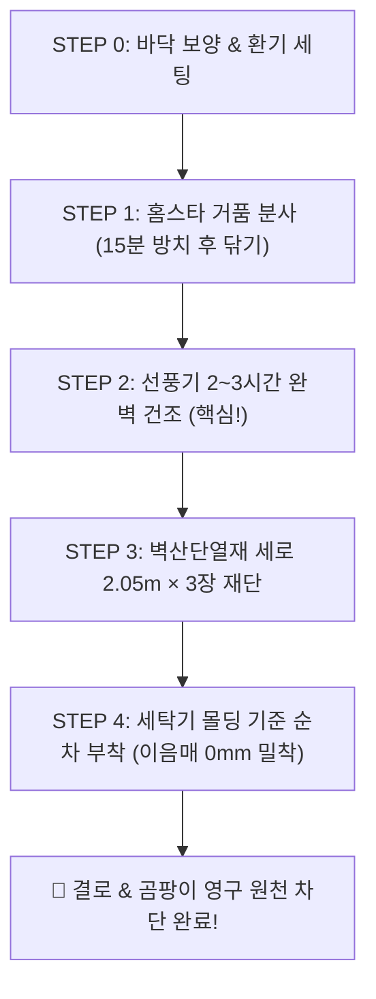

# 🛡️ 원룸 외벽 곰팡이 완전 박멸 및 접착식 단열벽지 셀프 시공 마스터 가이드

> **시공 대상**: 원룸 세탁기 및 싱크대 옆 외벽 (높이 약 2.0m ~ 2.2m × 가로 폭 약 3.0m)  
> **확정 자재**: 홈스타 맥스프레쉬 뿌리는 곰팡이 싹 (500ml) + 벽산단열재 접착식 단열벽지 (5mm 코튼화이트 10M)  
> **PDF 파일 위치**: [[원룸_곰팡이_박멸_및_단열벽지_완벽시공_가이드.pdf]] (바탕화면 및 본 폴더 저장 완료)

---

## 📊 1. 확정 구매 자재 및 준비물

| 자재 / 도구 | 규격 및 비용 | 역할 및 특징 |
| :--- | :--- | :--- |
| **홈스타 뿌리는 곰팡이 싹** | 500ml 1통 (약 3,700원) | 거품 밀착 분사로 15분 만에 곰팡이 균사체 뿌리까지 화학적 표백 박멸 |
| **벽산단열재 접착식 단열벽지** | **100cm × 10M (5mm 코튼화이트, 34,900원)** | 8중 PE폼 + 알루미늄 필름 층으로 외벽 결로 원천 차단 (1롤로 완벽 시공) |
| **가정 준비물 (추가비용 0원)** | 가위(커터칼), 줄자, 마른 수건(물티슈), 바닥용 신문지/비닐 | 시공 시 필요한 기본 도구 |

---

## 🧭 2. 5단계 완벽 시공 프로세스 로드맵

---

## 🛠️ 3. 단계별 실전 행동 수칙

### STEP 0 & 1 : 바닥 보양 및 기존 곰팡이 완전 박멸
1. **바닥 보양 필수**: 락스 물방울이 장판에 떨어지면 탈색될 수 있으므로, 벽면 아래 바닥에 **신문지 2~3겹이나 비닐**을 반드시 깔아둡니다.
2. **환기 세팅**: 창문을 활짝 열고 화장실 환풍기를 켜둡니다.
3. **거품 분사**: 세탁기 옆 몰딩부터 벽면 곰팡이 부위 전체에 거품을 촥촥 골고루 뿌려줍니다.
4. **15분 대기**: 문지르지 않고 그대로 두면 락스 성분이 균을 투명하게 녹여냅니다.
5. **표면 닦기**: 물티슈나 마른 걸레로 잔여 거품과 오염물을 깨끗이 닦아냅니다.

---

### STEP 2 : 완벽 건조 및 기존 벽지 점검 (★가장 중요한 단계)
> [!CAUTION]
> **축축한 상태에서 절대 벽지를 덮지 마세요!**  
> 수분이 남아있는 상태에서 붙이면 속에서 곰팡이가 다시 곪고 벽지가 떨어집니다.

- **건조 방법**: 선풍기나 서큘레이터를 벽면으로 향해 **강풍으로 2~3시간** 틀어둡니다. (급하면 헤어드라이기 10~15분 병행)
- **완벽 건조 판별법**: 손바닥으로 벽면을 꾹 눌렀을 때 **차가운 눅눅함이 전혀 없고 종이가 바스락거릴 정도로 뽀송뽀송**하면 합격입니다.
- **벽지 철거 여부**: 기존 벽지를 **통째로 뜯지 마세요.** 너덜너덜하게 들뜬 모서리만 칼로 살짝 잘라내고 기존 벽지 위에 그대로 붙이는 게 훨씬 깔끔합니다.

---

### STEP 3 & 4 : 벽산단열재 10M 재단 및 실전 부착
- **재단 공식**: 벽 높이(약 2m)에 위아래 여유 2~3cm를 두어 **`2.05m 길이로 3장`** 가위로 자릅니다. (총 6.15m 사용 / 남은 3.8m는 틈새 보수용 보관)
- **기준선 잡기**: 첫 번째 장은 **세탁기/싱크대 옆 타일 몰딩 라인에 수직을 정확히 맞춰서** 붙입니다.
- **쓸어내리며 부착**: 뒷면 은박 비닐을 위에서부터 30cm씩 조금씩 떼며 **마른 수건으로 중앙 ➔ 바깥쪽으로 쓸어내리며** 붙입니다.
- **이음매 마감**: 2번, 3번 장은 겹치지 말고 **단면끼리 딱 맞닿게(0mm 밀착)** 붙이면 실크 벽지처럼 깔끔해집니다.

---

## ❓ 4. 원룸 퇴실 시 원상복구 & 결로 방지 핵심 Q&A

### Q1. 나중에 이사 갈 때 떼면 벽이 상하나요?
- 접착력이 좋아 맨손으로 확 뜯으면 기존 얇은 벽지가 일어날 수 있습니다. 하지만 **집주인 90% 이상은 곰팡이 핀 벽보다 깨끗한 단열벽지가 붙어있는 상태를 훨씬 선호하여 떼라고 하지 않고 그대로 둡니다.**

### Q2. 집주인이 무조건 떼라고 원상복구를 요구하면?
- **헤어드라이기로 따뜻한 바람을 쐬어주면서 천천히 당겨 뜯으면** 접착 본드가 녹아서 밑 벽지 손상 없이 스티커처럼 깔끔하게 떨어집니다.

### Q3. 앞으로 곰팡이를 100% 막는 생활 습관
1. **가구 벽에서 10cm 띄우기**: 세탁기나 가구 뒤로 공기가 통하게 주먹 하나 공간을 만드세요.
2. **화장실 환풍기 24시간 켜두기**: 원룸 습기의 80%를 차지하는 화장실 습기를 바로 배출해 방 전체 습도를 10% 이상 낮춥니다.
