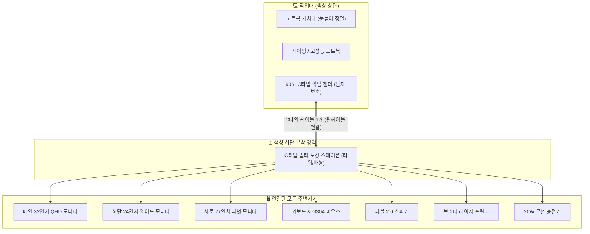

# 최소 비용 최대 효과 가성비 데스크 셋업 및 노트북 원케이블 도킹 완전 가이드

## 📌 아카이빙 필수 메타데이터
- **원본 출처**: https://youtu.be/-2mqtVXx3Xc?si=sB25-kdJvbAICVrS
- **원본 정보 발행일자**: 2026-08-17
- **내 보관소 등록일자**: 2026-08-18
- **영상 채널**: 미니 아빠 (제목: *최소 비용 최대 효과, 데스크 셋업은 이렇게 하세요*)

---

## 💡 핵심 요약
1. **단순함과 내구성이 최우선**: 조절 기능이 많은 고가 제품(의자 등)은 시간이 지나면 유격과 흔들림이 발생하므로, 잔고장 없는 대중적인 기본형 모델을 선택하는 것이 장기적으로 가장 합리적이다.
2. **시선 집중 기반의 모니터 세팅 철학**: 90% 이상 시선이 머무는 32인치 QHD 메인 모니터 위치를 먼저 확정하고, 하단(24인치 울트라와이드)과 우측 세로(27인치 피벗) 보조 모니터를 배치하여 목 피로도를 최소화한다.
3. **노트북 1대로 모든 공간을 통일하는 C타입 원케이블 도킹**: 책상 밑에 도킹 스테이션을 부착하고 모든 주변기기를 연결하여, 케이블 하나만 꽂으면 즉시 고성능 데스크탑으로 전환되는 이동형 작업 환경을 완성한다.

---

## 🖥️ 가성비 데스크 셋업 품목별 상세 분석 및 실전 노하우

### 1. 의자 — "기능이 많을수록 유격만 생긴다"
- **추천 모델**: 시디즈 탭플러스 (또는 듀오백 기본형)
- **선정 이유**:
  - 고가 고급형 의자는 체형 맞춤 조절 관절이 많아 장기간 하중이 가해지면 필연적으로 유격과 삐걱거림 발생.
  - 조절 기능이 최소화된 기본형 의자는 내구성이 뛰어나 유격이 생기지 않음.
- **실전 팁**: 기본형 의자를 구비하고 사용자의 자세를 맞추는 것이 가성비와 허리 건강에 가장 유리함.

---

### 2. 책상 — 모션 데스크 (전동 높이조절)
- **스펙 & 가격**: 1400 × 750 mm 상판 일체형 (배송·기사 방문 설치 포함 약 23만 원)
- **주요 특징**:
  - 최대 하중 60kg, 높이 조절 범위 720 ~ 1200mm, 메모리 높이 저장 지원.
  - 두꺼운 H자형 프레임 구조로 다중 모니터 암을 거치해도 흔들림 없이 안정적인 리프팅.
- **실전 팁**: 모니터 암을 다수 장착할 때는 상판 흔들림 방지를 위해 프레임 두께와 지지 하중을 필수로 확인.

---

### 3. 조명 & 인테리어 소품
- **T5 LED 간접 조명**: 커튼 박스 2개 + 책상 하단 1개 (총 3개).
  - *팁*: 저가형 스트립(줄 조명)보다 T5 바(Bar) 조명이 훨씬 고르고 따뜻한 간접광 분위기를 연출.
- **벽걸이 시계**: 8,000원대 심플 시계.
- **헤드폰 거치대**: 4개 7,000원대 부착형.
- **부착식 미니 서랍**: 큰 서랍은 의자 팔걸이에 걸리므로 3,000원대 콤팩트 서랍을 책상 끝에 부착.

---

### 4. 모니터 & 모니터 암 — "메인 모니터 중심주의"
- **메인 모니터**: **한성 32인치 QHD IPS** (가정/작업용 가성비 공식)
- **보조 모니터 구성**:
  - 하단: 한성 24인치 울트라와이드 (목을 옆으로 돌리는 것보다 시선을 아래로 내리는 것이 편함)
  - 우측: 크로스오버 27인치 피벗 (세로 문서/코드/채팅창 확인용)
- **모니터 암**: 넥시(Nexi) 듀얼 모니터 거치대 (봉 길이가 가장 긴 모델을 골라야 상하 세팅 가능)
- **배치 철학**:
  1. 가장 선호하는 해상도/크기의 메인 모니터를 정면 눈높이에 1순위로 확정.
  2. 남는 빈 공간에 맞춰 보조 모니터를 상하 또는 세로로 배치.

---

### 5. 입력장치 & 오디오
- **마우스**: **로지텍 G304 무선** (AA 건전지 1개로 수개월 지속, 가성비 및 센서 정확도 원탑).
- **키보드 선택 기준**:
  - 독거미(AULA F108) 등 유행하는 키보드라도 먹먹하거나 심심한 타건감은 호불호 발생.
  - 2만 원대 가성비 무선 기계식(청축/적축) 커스텀 키보드 등 본인 손맛에 맞는 확실한 구분감 선택.
- **스피커**: **크리에이티브 페블(Creative Pebble) 2.0** (2만 원대).
  - USB 전원 스피커 중 출력과 공간감이 뛰어나며 2만 원대에서 PC 스피커 종결 가능.

---

### 6. 프린터 — 장기 관리 중심의 레이저 선택
- **모델**: **브라더(Brother) 흑백 레이저 복합기/프린터**
- **선정 기준**:
  - 가정용 출력 빈도가 낮을 때는 잉크젯 노즐이 굳으므로 레이저가 필수.
  - 과거 수년간 컬러 출력을 안 했다면 불필요한 컬러 토너 비용을 빼고 흑백 전용 선택.
  - A4 용지가 기기 내부 트레이에 완전히 수납되어 먼지가 쌓이지 않는 구조.

---

### 7. 🔌 노트북 원케이블 도킹 스테이션 (핵심 아키텍처)

#### 도킹 스테이션 구축 핵심 포인트:
1. **타워/바(Bar)형 도킹 스테이션 책상 하단 부착**:
   - 모니터 3대 + 주변기기 동시 연결 시 발생하는 발열 해소 및 책상 위 케이블 완전 은닉.
2. **90도 C타입 ㄱ자 젠더 사용**:
   - 거치대에 올린 노트북 단자에 가해지는 케이블 하향 꺾임 스트레스를 없애 단자 파손 방지.
3. **노트북 1대로 멀티 공간 통일**:
   - 사무실과 집 모두 도킹 스테이션을 세팅해 두면 케이블 1개 탈착만으로 작업 환경 연속성 유지.

---

## 🛠️ AI(Antigravity) 및 사용자 시스템 적용 전략

### 1. '유격 없는 단순함' 소프트웨어 아키텍처 적용
- **원리**: 복잡한 다기능 고급 의자가 유격을 만들듯, 소프트웨어에서도 불필요한 라이브러리와 과도한 레이어는 버그와 유지보수 비용(유격)을 유발함.
- **적용**: Antigravity 개발 시 프론트엔드는 가벼운 바닐라 CSS/Vite, 백엔드는 표준 REST FastAPI로 군더더기 없는 '유격 제로' 구조 유지.

### 2. 시선 90% 집중 인터페이스 설계
- **원리**: 듀얼/트리플 모니터에서도 메인 화면 1개에 집중도가 90% 쏠림.
- **적용**: 웹 UI 개발 시 F-패턴/Z-패턴을 적용하여 핵심 CTA와 정보를 화면 중앙 상단에 집중시키고, 보조 설정은 하단/사이드로 격리.

### 3. 모바일/노트북 원격 에이전트 도킹 연계
- **원리**: 노트북 1개로 언제 어디서나 동일한 환경을 불러오는 도킹 철학.
- **적용**: 사용자의 데스크탑(Ryzen 5600X/RX 6600)을 메인 컴퓨팅 노드로 두고, 외부에서는 Cloud Run / 모바일 에이전트를 통해 단일 워크스페이스에 원격 접속하는 원격 도킹 파이프라인 구축.
