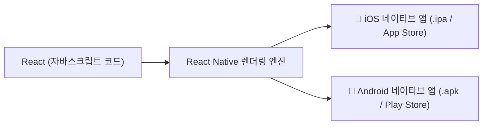

# 📱 React 웹 개발자를 위한 React Native 모바일 앱 개발 핵심 개념 정리

> **📌 아카이빙 메타데이터**
> - **원본 출처**: [Expo 공식 영상 (From React Web to React Native in 60 Seconds)](https://www.youtube.com/watch?v=8ExmJ7gqVaw)
> - **원본 정보 발행일자**: `2026-08-08`
> - **내 보관소 등록일자**: `2026-08-14`
> - **핵심 주제**: 웹 React 개발 지식으로 iOS/Android 크로스 플랫폼 네이티브 모바일 앱 개발하기

---

## 💡 1. 리액트 네이티브(React Native)의 본질



* **개념**: 웹 브라우저 화면을 만드는 리액트 문법 그대로 **아이폰과 갤럭시에 직접 설치해서 쓰는 스마트폰 앱(Native App)**을 제작하는 프레임워크입니다.
* **원 소스 멀티 유즈 (One Source Multi-Use)**: 원래는 iOS용(Swift)과 Android용(Kotlin/Java)을 따로따로 두 번 개발해야 했으나, 리액트 코드 하나로 두 운영체제 앱을 동시에 완성합니다.
* **실제 활용 사례**: 인스타그램(Instagram), 디스코드(Discord), 페이스북(Facebook), 핀터레스트, 코인원 등 글로벌 대표 앱들이 채택하고 있습니다.

---

## ⚖️ 2. 일반 React(웹) vs React Native(모바일) 비교

| 비교 항목 | 일반 리액트 (React / Web) | 리액트 네이티브 (React Native / Mobile) |
| :--- | :--- | :--- |
| **최종 결과물** | 크롬/사파리로 접속하는 **웹사이트** | 앱스토어에서 다운받아 설치하는 **스마트폰 앱** |
| **렌더링 레이어** | `React DOM` (브라우저 DOM 트리) | `React Native` (모바일 OS 네이티브 뷰) |
| **기본 뼈대 요소** | HTML 태그 (`div`, `span`, `p`, `img`) | 전용 네이티브 컴포넌트 (`View`, `Text`, `Image`) |
| **스타일링** | 표준 `.css`, SCSS, TailwindCSS | `StyleSheet.create({})` (자바스크립트 객체) |
| **핵심 문법 호환** | 컴포넌트 구조, Hooks(`useState`, `useEffect`), 상태 관리 **100% 동일** | 컴포넌트 구조, Hooks(`useState`, `useEffect`), 상태 관리 **100% 동일** |

---

## 🧩 3. 웹 개발자를 위한 코드 문법 1:1 매핑

### ① 태그(컴포넌트) 변환
* `<div>` (레이아웃 박스) ➔ `<View>`
* `<span>`, `<p>`, `<h1>` (모든 텍스트) ➔ `<Text>` *(React Native는 텍스트를 반드시 `<Text>`로 감싸야 함)*
* `` (이미지) ➔ `<Image source={{ uri: '...' }} />`
* `<button>` (클릭 요소) ➔ `<TouchableOpacity>` 또는 `<Pressable>`
* `<input>` (입력창) ➔ `<TextInput>`
* 스크롤 영역 ➔ `<ScrollView>` 또는 `<FlatList>` (대용량 리스트 최적화)

### ② 스타일링 방식 (StyleSheet API)
일반 CSS 파일 대신 자바스크립트 객체로 작성하며, 모바일 화면 특성에 맞춰 기본적으로 **Flexbox 레이아웃**이 적용됩니다.

```javascript
import React from 'react';
import { StyleSheet, Text, View } from 'react-native';

export default function App() {
  return (
    <View style={styles.container}>
      <Text style={styles.title}>리액트로 만든 스마트폰 앱</Text>
    </View>
  );
}

const styles = StyleSheet.create({
  container: {
    flex: 1,
    backgroundColor: '#ffffff',
    alignItems: 'center',
    justifyContent: 'center',
  },
  title: {
    fontSize: 20,
    fontWeight: 'bold',
    color: '#333333',
  },
});
```

---

## 🚀 4. 시작 도구: Expo (엑스포)

* **Expo의 역할**: 리액트 네이티브 개발 시 복잡한 안드로이드 스튜디오나 Xcode 설정 없이 웹 개발처럼 브라우저와 스마트폰 실물 기기(Expo Go 앱)에서 QR코드를 찍어 실시간으로 화면을 보며 개발할 수 있게 해주는 툴킷입니다.
* **학습 가치**: 이미 HTML/CSS/React 기본기가 있다면 1~2주 만에 실제 동작하는 스마트폰 앱을 직접 제작하여 배포할 수 있습니다.

## 관련
- [[코딩_및_개발_지식_정리]]
- [[GitHub_Stacked_PRs_워크플로우_및_실전_가이드]]
