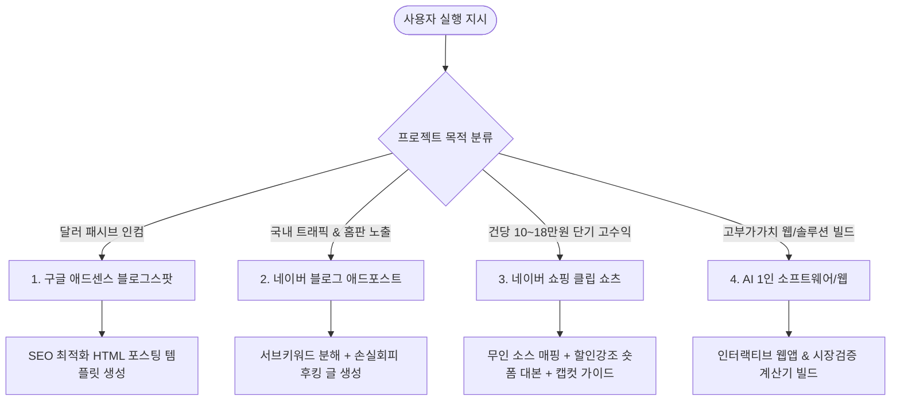

# ⚡ 수익화 및 부업 즉시 실행 통합 치트시트 (Master Playbook)

> **상태**: 🚀 즉시 가동 준비 완료 (Ready to Execute)  
> **최종 갱신**: 2026-08-15  
> **목적**: 사용자의 다음 작업 지시 즉시 1초 만에 최적의 수익화 모델을 선택하고, 제작/배포/수익 파이프라인을 완전 자율로 구축하기 위한 핵심 실행 매뉴얼.

---

## 🎯 4대 핵심 수익화 엔진 요약 및 분업 체계

---

## 🛠️ 즉시 가동 가능한 4대 실행 모듈 (Ready-to-Run)

### 🌐 Module 1. 구글 애드센스 블로그스팟 (달러 자동화)
- **주요 활용**: 글로벌 고단가 키워드 (비자, ETIAS, 청년정책, 해외 노마드 가이드)
- **필수 구성요소**:
  - 애드센스 승인용 필수 4대 페이지 (`About`, `Privacy Policy`, `Terms`, `Contact`)
  - 인라인 스타일 완전 포함 독립형 HTML 템플릿 (H1, H2, FAQ 아코디언, 계산기 박스)
- **즉시 출력 형식**: `02_1호_포스팅_*.html` 완성본 생성 및 바로 붙여넣기 가능한 코드 제공

---

### 📈 Module 2. 네이버 블로그 애드포스트 (트래픽 폭발)
- **핵심 공식**: `크리에이터 어드바이저 경제 키워드` $\rightarrow$ `네이버 검색 연관검색어로 3개 분해` $\rightarrow$ `손실 회피형 후킹 제목`
- **제목 프레임워크**:
  - `손실 회피`: "[서브 키워드], 이 시간대 환전하면 남들보다 세 배 손해 봅니다"
  - `비교 우위`: "[지원금], 90%가 놓치는 신청 조건 1가지"
- **본문 포맷**: 모바일 화면 기준 1~2줄 단위 줄바꿈, 볼드/소제목 문단 분할, 체류시간 극대화 레이아웃

---

### 🛍️ Module 3. 네이버 쇼핑 클립 & 브랜드 커넥트 (고단가 제휴)
- **수익 타깃**: 건당 수수료 10~18만 원 (대형 가전, 폴더블폰, 고가 리빙)
- **4단계 무인 제작 파이프라인**:
  1. **소스 수집**: 틱톡/인스타그램 영문 검색 (`LG 85 smart tv`, `galaxy z fold unboxing`) 무인 고화질 영상 3~4개 확보
  2. **AI 대본**: 할인 강조형 (손실 회피 후킹 $\rightarrow$ 원래 300만 원 $\rightarrow$ 지금 200만 원 $\rightarrow$ 하단 태그 실시간 가격 확인 CTA)
  3. **TTS 음성**: 자연스러운 AI 성우 오디오 추출
  4. **캡컷 9:16 편집**: 자동 캡션(자동 자막), 2초 단위 씬 분할(Scene Split), 쇼핑 태그 직결

---

### ✨ Module 4. AI 1인 소프트웨어 & 인터랙티브 웹 (고단가 솔루션)
- **주요 활용**: 1만 달러 가치 인터랙티브 웹사이트, 비자/환율 계산기, 시장 검증기
- **디자인 표준**: Pretendard 타이포그래피, 하이엔드 다크/라이트 럭셔리 UI, 부드러운 인터랙션, 제로 AI-슬롭(Slop) 원칙

---

## ⚠️ 부업 실패 방지 3대 철칙 (Anti-Pattern)

1. **마진 붕괴 이커머스 절대 금지**:
   - 쿠팡 수수료(10%) + 물류비 + 광고비(CPC) 차감 후 마진 20% 미만 아이템 사입 금지
   - 공장 저가 배합에 라벨만 바꾸는 무의미한 건기식 PB 금지
2. **백엔드 없는 단순 조회수 노동 금지**:
   - 1년에 20만 원 나오는 유튜브 단순 애드센스에 매달리지 않고, 반드시 **고단가 제휴태그(쇼핑 커넥트)**나 **자체 솔루션 링크** 연결
3. **오프라인 하자/퇴거 리스크 배제**:
   - 집주인 매도 시 강제 퇴거당하는 오프라인 공간 대신 100% 디지털 자산 및 소프트웨어 기반 파이프라인 집중

---

## 🎯 다음 작업 호출 시 행동 프로토콜
사용자가 주제나 작업 아이디어를 제시하는 즉시:
1. 적합한 **수익화 모듈(1~4)**을 자동 판별
2. 질문으로 시간 끌지 않고 **기획 $\rightarrow$ 대본/HTML/코드 생성 $\rightarrow$ 옵시디언 자동 아카이빙**까지 원스톱으로 즉시 결과물 산출

## 관련
- 목차: [[04_부업_및_수익화_자동화/00_수익화_자동화_대시보드]]
