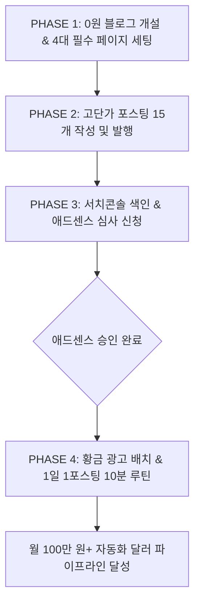

# 🏛️ 구글 블로그스팟 & 애드센스 0원 무자본 월 100만 원 달러 파이프라인 마스터 계획서
> **1) 원본 출처**: 구글 공식 애드센스 가이드 및 실전 수익화 커뮤니티 종합
> **2) 원본 정보 발행일자 (source_date)**: 2026-08-14
> **3) 내 보관소 등록일자 (registered_date)**: 2026-08-14

---

## 🎯 실행 목표
초기 자본금 0원으로 **구글 블로그스팟(Blogger)**을 개설하고, 2주 만에 **구글 애드센스 1회 합격**을 달성한 뒤, AI 협업 파이프라인으로 **월 $500~$1,000(약 70~140만 원)의 패시브 달러 인컴**을 구축합니다.

---

## 📅 4단계 30일 완성 로드맵

---

## 🛠️ PHASE 1: 구글 블로그스팟 0원 완벽 세팅 (Day 1~2)

### 1. 블로그스팟 개설 및 필수 옵션
* **플랫폼**: [Blogger.com](https://www.blogger.com) (구글 계정으로 로그인 후 1초 개설)
* **테마**: 가독성과 로딩 속도가 가장 빠른 **`Contempo Light`** 또는 **`Notable Light`** 선택
* **필수 4대 관리자 설정**:
  1. **HTTPS 리디렉션**: `항상 사용 (ON)`
  2. **메타 설명(SEO)**: `사용 설정 (ON)` ➔ 블로그 소개 키워드 입력
  3. **맞춤 robots.txt & 로봇 헤더 태그**: 구글 검색 봇 수집 활성화
  4. **모바일 반응형 뷰**: 자동 지원 테마 확인

### 2. 애드센스 1회 합격용 '4대 필수 정적 페이지'
구글 심사관 AI가 가장 먼저 체크하는 4개 페이지를 상단 메뉴에 링크로 고정합니다.
1. **About Us (블로그 소개)**: 정책/금융 전문 정보 제공 목적 소개
2. **Contact Us (문의하기)**: 운영자 이메일 주소 기재
3. **Privacy Policy (개인정보처리방침)**: 구글 애드센스 쿠키 표준 처리 문구
4. **Terms of Service (이용약관)**: 정보 면책 조항 기재

---

## ✍️ PHASE 2: 애드센스 1회 합격 15개 황금 포스팅 (Day 3~14)

### 1. 승인률 1위 카테고리: `정부지원금 & 복지 금융` (CPC $3~$15)
구글 AI가 가장 신뢰하는 공공/정책 데이터 키워드 15선:
1. 2026 청년도약계좌 신청 자격 및 매칭 기여금 총정리
2. 서민금융진흥원 햇살론 유스 신청 자격 및 금리 혜택
3. 소상공인 정책자금 저금리 대환대출 신청 서류
4. 근로장려금 정기 신청 기간 및 가구별 지급액
5. 부모급여 지원 금액 및 아동수당 중복 수령 방법
6. 청년 월세 특별지원 신청 조건 및 거주 요건
7. 국민취업지원제도 1유형 구직촉진수당 300만원 수령법
8. 알뜰교통카드 K-패스 환급률 및 혜택 비교
9. 기초연금 수급 자격 모의계산 및 재산 기준표
10. 실업급여 수급 조건 및 1일 상한액 계산법
11. 에너지바우처 신청 자격 및 동절기 난방비 지원
12. 치아보험 임플란트 건강보험 본인부담금 혜택
13. 전세보증금 반환보증 HUG 가입 조건 및 보증료 할인
14. 난임부부 시술비 지원 확대 소득 기준 폐지 안내
15. 장애인연금 및 장애수당 지급 대상자 가이드

### 2. 구글이 좋아하는 1,500자 포스팅 황금 뼈대
* **제목 (H1)**: 핵심 키워드 + 구체적인 대상 + 완벽 가이드
* **서론**: 3~4줄로 결론부터 즉답 제시 (두괄식 AEO 최적화)
* **본문 (H2 소제목 3~4개)**:
  * 소제목 1: 지원 대상 및 신청 자격 (표/테이블 삽입)
  * 소제목 2: 세부 지원 금액 및 금리 혜택 (불릿 리스트)
  * 소제목 3: 4단계 간편 신청 절차 (스텝 순서도)
* **결론 (H2)**: 최종 요약 체크리스트 및 마감일 주의사항

---

## 🚀 PHASE 3: 애드센스 심사 신청 & 서치콘솔 색인 (Day 15)

1. **포스팅 15개 발행 완료 점검**
2. **구글 서치콘솔 (Search Console)**: 내 블로그 등록 ➔ `sitemap.xml` 제출 ➔ 15개 URL 즉시 색인 요청
3. **구글 애드센스 (AdSense)**: `사이트 추가` ➔ 블로그 URL 입력 ➔ 코드 삽입 후 심사 제출
4. **심사 기간(3~7일)**: 2~3일에 글 1개씩 추가 발행하며 대기 ➔ **승인 통과 완료!**

---

## 💰 PHASE 4: 승인 후 달러 수익 극대화 공식 (Day 20~)

### 1. 광고 배치 황금 공식
* **전면 광고 (Vignette)**: `ON` (전체 수익의 40% 차지하는 핵심)
* **본문 상단 사각 광고**: 제목 바로 밑 1개 (클릭률 최고)
* **본문 중간 광고**: 소제목 사이 2개
* **모바일 하단 앵커 배너**: `ON`

### 2. AI 협업 1일 1포스팅 10분 루틴
1. 사용자: *"오늘 청년 월세 지원 정책 글 써줘"*
2. AI(Antigravity): **1,500자 완성형 SEO 포스팅 3초 만에 생성**
3. 사용자: 복사 ➔ 블로그스팟에 붙여넣기 ➔ 발행 클릭 ➔ 서치콘솔 색인 요청 (총 5분 소요)

## 관련
- 목차: [[04_부업_및_수익화_자동화/00_수익화_자동화_대시보드]]
