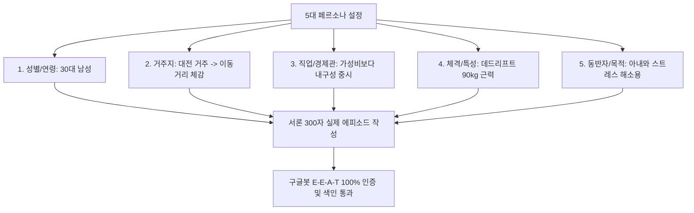

# 애드센스 승인 한 번에 받는 법: 구글 서치 콘솔 색인 10개와 5대 페르소나 경험 주입법

> **[아카이빙 메타데이터]**
> - **원본 출처**: https://youtu.be/to2JHpg59UY?si=3vQrr_DKr7Dagm9u
> - **원본 정보 발행일자**: 2026년 3월 30일
> - **보관소 등록일자**: 2026년 8월 15일
> - **채널**: 아로스TVㅣ부업 1위

---

## 💡 핵심 요약 (3줄 요약)
1. **2026년 구글의 AI 스팸 필터링과 서치 콘솔 색인**: 단순 사실 나열형 AI 글은 구글봇이 '크롤링됨 - 색인 생성 안 됨'으로 분류해 버리므로, 구글 서치 콘솔(GSC)에 **최소 10개 이상의 포스팅이 '색인 생성됨' 상태**여야 애드센스 승인을 통과합니다.
2. **AI 스팸을 우회하는 5대 페르소나 경험 주입**: 구글에 이미 존재하는 사실 정보 대신, 글쓴이의 **성별/연령, 거주 지역, 직업/경제관, 운동/생활 특성, 이용 목적 5대 페르소나**를 바탕으로 한 300자 실제 경험 스토리를 녹여내야 합니다.
3. **수동 색인 요청 및 승인 신청 3단계 공식**: 글 20편 작성 즉시 애드센스 신청 $\rightarrow$ 심사 대기 기간(2~4주) 동안 하루 10~12개씩 서치 콘솔 수동 색인 요청 $\rightarrow$ 색인 10개 도달 시 무조건 승인 완료.

---

## 📌 애드센스 100% 1회 통과 실행 매뉴얼

### 1. 구글 서치 콘솔(GSC) 색인 상태 진단 [02:45 ~ 04:50]
- **서치 콘솔의 의미**: 구글 생태계에서 이 글이 검색 가치가 있는지 1차 면접을 보는 곳
- **치명적 경고**: `페이지 > 크롤링됨 - 현재 색인이 생성되지 않음`
  - 의미: 구글봇이 글을 읽었으나 "가치 없는 복붙/AI 스팸"으로 판단하여 거절한 상태
- **해결책**: 글을 삭제하지 말고, **제목과 서론 1~2문장을 고유 경험으로 수정한 뒤 수동 색인 재요청**

---

### 2. 구글봇을 통과시키는 '5대 페르소나 경험 주입 공식' [04:51 ~ 08:20]
구글은 이미 전 세계 모든 사실(Fact)을 알고 있습니다. 구글이 원하는 것은 **"실제 한 인간의 구체적 맥락과 경험"**입니다.

- **실전 적용 예시 (텐트 조립 후기)**:
  - *일반 AI 글*: "솔롱고 텐트는 내구성이 좋고 설치가 간편합니다." (탈락)
  - *페르소나 주입 글*: "헬스장에서 데드리프트 90kg을 드는 완력인데도, 라디트 솔롱고 텐트 폴캡에 폴대를 끼우려다 원단 수축 때문에 손가락이 나갈 뻔했습니다. 성인 남성 혼자서는 힘드니 고객센터 팁대로 미리 원단을 늘려둬야 합니다." (합격)

---

### 3. 수동 색인 요청 및 승인 로드맵 [08:25 ~ 12:25]

#### 1단계: 글 20개 작성 & 애드센스 즉시 신청
- 글 20편이 완성되면 승인을 기다리지 말고 즉시 애드센스 심사 신청 클릭

#### 2단계: 심사 대기 기간(2~4주) 중 수동 색인 작업
- 구글 서치 콘솔 `URL 검사 > 색인 생성 요청` (하루 최대 10~12개 할당량 소진)
- 일주일 이상 색인이 지연되면 제목 앞머리와 서론 단어 1~2개 수정 후 재신청

#### 3단계: 색인 10개 확보 시 최종 승인
- 최소 10개 포스팅이 '색인 생성됨' 도장을 받으면 구글봇이 사이트 신뢰도를 검증하여 승인 메일 발송

---

## ⚡ AI(Antigravity) 시스템 및 사용자 워크플로우 적용점

### 1. 블로그스팟 포스팅 생성기에 '5대 페르소나 주입 모듈' 장착
- 모든 글 생성 시 단순 매뉴얼 작성을 금지하고, **[1인칭 시점의 상황 설정 + 구체적 수치/불편함 해결 에피소드 + 솔직한 주관적 평가] 300자**를 서론에 필수 삽입

### 2. 구글 서치 콘솔 수동 색인 가이드라인 자동화
- 포스팅 생성 완료 시 사용자가 즉시 복사해 서치 콘솔 URL 검사창에 넣을 수 있도록 URL 목록 자동 정리

### 3. 3대 애드센스 승인 바이블의 통합 완성
- **1편 (디파서블)**: [수익형 키워드 3대 원칙](file:///C:/전일도/04_부업_및_수익화_자동화/01_구글_애드센스_및_블로그스팟/애드센스_월1000달러_수익형_글쓰기_3대원칙_디파서블.md) (브랜드/할인/카드 앵커)
- **2편 (듀얼인컴)**: [사이트 구조와 4대 필수 페이지](file:///C:/전일도/04_부업_및_수익화_자동화/01_구글_애드센스_및_블로그스팟/애드센스_승인_무한거절_탈출_사이트구조_신뢰도_3대원칙_듀얼인컴.md) (외모/신뢰도)
- **3편 (아로스)**: 본 문서 (서치 콘솔 색인 10개 + 5대 페르소나 경험)
- $\rightarrow$ **구글 애드센스 100% 1회 무조건 통과 마스터 트라이앵글 완성!**

## 관련
- 목차: [[04_부업_및_수익화_자동화/00_수익화_자동화_대시보드]]
