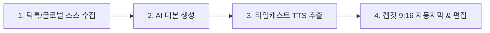

# 네이버 쇼핑 쇼츠 & 브랜드 커넥트 틈새시장 고수익 자동화 전략

> **[아카이빙 메타데이터]**
> - **원본 출처**: https://youtu.be/JfwZ7uOTn9w?si=uzxnQdzKrX4BBMUS
> - **원본 정보 발행일자**: 2026년 8월 8일
> - **보관소 등록일자**: 2026년 8월 15일
> - **채널**: 돈농부

---

## 💡 핵심 요약 (3줄 요약)
1. **유튜브 포화 속 네이버 클립 블루오션**: 유튜브 쇼핑 쇼츠가 과열된 반면, 네이버 브랜드 커넥트(쇼핑 커넥트)와 네이버 클립은 구매력 높은 4050 세대 트래픽이 집중된 미개척 고수익 틈새시장입니다.
2. **검색 의도 가로채기(Search-Intent Capturing)**: 호기심 유발 위주의 쿠팡 파트너스와 달리, 네이버 검색창에 특정 고가 제품(대형 TV, 폴더블폰 등)을 검색하는 '이미 살 준비가 된 고관여 구매자'를 타깃해 높은 전환율과 건당 10~18만 원의 커미션을 확보합니다.
3. **무자본 AI 숏폼 4단계 제작 시스템**: 틱톡 해외 무인 소스 추출, AI 대본 생성(할인 강조형), 자연스러운 TTS 나레이션, 캡컷 9:16 자동 자막 및 컷편집으로 하루 10분 만에 영상을 완성해 쇼핑 태그와 직결합니다.

---

## 📌 주요 타임라인 및 핵심 실행 매뉴얼

### 1. 시장 분석: 유튜브 쇼츠 vs 네이버 쇼핑 클립 [00:00 ~ 00:46]
- **유튜브 쇼핑 쇼츠의 한계**: 수많은 크리에이터가 진입하여 현재 경쟁이 극도로 치열한 포화 상태
- **네이버 브랜드 커넥트의 강점**:
  - 네이버 포털 특성상 전 국민 대상 노출
  - 실제 소비력과 결제력이 가장 왕성한 40~50대 여성/가구주 트래픽 비중 압도적
  - 네이버 검색 결과 최상단에 '클립(숏폼)' 영역이 우선 배치되어 검색 유입 독점 가능

---

### 2. 네이버 브랜드 커넥트 & 클립 계정 세팅 [00:47 ~ 03:34]
1. **크리에이터 센터 접속**: 네이버 크리에이터 어드바이저 > 브랜드 커넥트 시작하기
2. **클립 프로필 생성**: 네이버 클립 전용 프로필/아이디 생성 (기존 아이디 연동 무방)
3. **스페이스 및 카테고리 설정**:
   - 메인 주제: IT/테크, 가전
   - 서브 주제: 리빙/생활건강 (단가 높고 할인 폭 큰 품목 위주)
   - 공동구매 진행 경험 없음 선택 후 간편 통과
4. **정산 정보 등록**: 개인 사업자 또는 일반 개인(원천징수) 선택 후 즉시 승인
5. **쇼핑 커넥트 링크 발급**:
   - 상품 검색창에서 고단가 전자기기 검색 (예: LG 스마트 TV, 삼성 QLED)
   - 3~6% 수수료율 상품 링크 다량 발급 및 발급 링크 관리함에서 복사

---

### 3. 수익 모델의 본질: 쿠팡 파트너스 vs 네이버 쇼핑 커넥트 [03:48 ~ 05:08]

| 비교 항목 | 쿠팡 파트너스 (호기심 유발형) | 네이버 쇼핑 커넥트 (검색 의도 장악형) |
| :--- | :--- | :--- |
| **유입 경로** | 피드 탐색 중 우연한 발견, 알고리즘 추천 | 네이버 검색창 직접 입력 (`LG 85인치 TV` 등) |
| **고객 상태** | 살까 말까 고민 중이거나 무의식적 탐색 | **이미 구매를 결심하고 가격/혜택을 찾는 상태** |
| **전환 전략** | 자극적인 썸네일, 충동 구매 유도 | **"지금 100만 원 할인 중", "이 스펙만 보고 사세요" 확신 제공** |
| **주력 단가** | 1~5만 원대 생활용품 (건당 몇백 원~몇천 원) | **100~300만 원대 대형 가전 (건당 10~18만 원)** |

---

### 4. 고수익 제품 선정 기준 [05:50 ~ 06:55]
- **핵심 공식**: `고단가(100만 원 이상) × 높은 할인율(30~50%) × 수수료율 3~6%`
- **대표 추천 제품군**:
  - **삼성 갤럭시 Z 폴드**: 판매가 약 310만 원 / 수수료 6% (기본 3% + 추가 3%) $\rightarrow$ **1대 판매 시 18만 원**
  - **LG/삼성 85인치 스마트 TV**: 판매가 약 200만 원 / 수수료 5% $\rightarrow$ **1대 판매 시 10만 원**
- 하루 1건만 전환되어도 월 300~500만 원대 부업 수익 달성 가능

---

### 5. 무자본 AI 영상 제작 4단계 프로세스 [06:56 ~ 14:50]

#### ① 영상 소스 수집 (해외 숏폼 무인 소스) [06:56 ~ 08:05]
- 틱톡/인스타그램에 영문 제품명 검색 (예: `LG 85 smart tv`, `galaxy z fold unboxing`)
- 얼굴이 나오지 않는 고화질 언박싱, 설치, 실사용 화면 3~4개 다운로드

#### ② AI 대본 생성 (할인 강조형 구조) [08:06 ~ 08:49]
- **핵심 후킹**: *"이 제품 비싸게 산 분들은 진짜 배 아플 수 있습니다."*
- **가격 앵커링**: 원래 300만 원대 $\rightarrow$ 현재 200만 원대 파격 할인 강조
- **가치 제시**: 거실을 영화관으로 만드는 압도적 크기와 화질
- **행동 유도(CTA)**: *"할인 끝나기 전에 아래 제품 보기를 눌러 실시간 가격을 확인해보세요."*

#### ③ 나레이션 추출 (Typecast TTS) [08:50 ~ 09:27]
- 자연스러운 톤의 AI 성우 선택 (스마트 이모션 기능 ON)
- 오디오 파일(.mp3) 다운로드

#### ④ 캡컷(CapCut) 영상 편집 [09:28 ~ 14:50]
- 비율: 세로 9:16 설정
- 오디오 업로드 후 `텍스트 > 자동 캡션(Auto Caption)` 실행
- 가독성 높은 노란색/흰색 자막 스타일 적용 및 오탈자/숫자 단위 수정
- `장면 자동 분할(Scene Split)`을 활용해 나레이션 리듬에 맞춰 1.5~2.5초 단위 컷 전환
- 완성 영상 고화질 MP4 내보내기

---

### 6. 네이버 TV / 클립 업로드 및 쇼핑 태그 연동 [14:51 ~ 16:44]
1. **네이버 TV 채널 개설**: 채널명 설정 (예: `할인팡팡`, `가전스펙정리`)
2. **클립 업로드**: 9:16 완성 영상 업로드
3. **검색 최적화 제목 작성**: `[제품명 + 인치/모델명 + 싸게 사는 법 / 할인 꿀팁]`
4. **카테고리 선택**: 테크 / 가전 / 리빙
5. **쇼핑 커넥트 연동**: 발급받은 제휴 링크 제품을 영상 하단 '쇼핑 태그'로 지정 후 공개
6. **구매 유도 결과**: 영상 시청 중 하단 태그 클릭 시 즉시 네이버 쇼핑 공식 구매 페이지로 이동하여 구매 발생

---

### 7. 알고리즘 지속성 및 운영 전략 [16:45 ~ 17:31]
- 네이버 클립은 단기 바이럴보다 네이버 검색 탭 상단에 누적 노출되는 **롱테일(Long-tail) 검색 자산** 성격이 강함
- 신제품 출시, 계절 가전(에어컨, 제습기), 대형 할인 시즌에 맞춰 카테고리별 10~20개 파이프라인을 구축해 두면 꾸준한 패시브 인컴 창출 가능

---

## ⚡ AI(Antigravity) 시스템 및 사용자 워크플로우 적용점

### 1. 고전환 네이버 클립 대본 생성 프롬프트 모듈화
- 기존 블로그용 글쓰기 프롬프트와 별도로, **15~30초 검색 의도 장악형 숏폼 대본 템플릿**을 구축
- **대본 4대 프레임**:
  1. `손실 회피 후킹`: "남들보다 100만 원 더 주고 사지 마세요"
  2. `가격 앵커링`: 정가 대비 실시간 할인가 비교
  3. `핵심 USP 2가지`: 크기/성능 등 체감 포인트만 제시
  4. `클릭 유도 CTA`: "하단 태그 눌러서 현재 재고/가격 확인"

### 2. 고마진 상품 데이터 마이닝 및 키워드 자동 추출
- 네이버 쇼핑 커넥트 수수료 4% 이상 + 단가 100만 원 이상 상품군 리스트업
- 영문 틱톡/릴스 검색어(Query)를 즉시 매핑해 주는 자동 스크립트 작성 워크플로우 지원

### 3. 블로그 포스팅 + 클립 숏폼 '원소스 멀티채널' 파이프라인 연계
- 기존 보관소에 정리된 `네이버 블로그 오리나 애드포스트 전략`과 본 `쇼핑 클립 전략`을 결합
- 1개 경제/가전 키워드 발굴 시:
  - **네이버 블로그**: 검색 뷰 롱폼 포스팅 (애드포스트 수익)
  - **네이버 클립**: 20초 요약 숏폼 + 쇼핑 태그 (건당 10만 원 제휴 수수료)
  - **듀얼 파이프라인**을 한 번에 가동하여 수익 극대화

## 관련
- 목차: [[04_부업_및_수익화_자동화/00_수익화_자동화_대시보드]]
