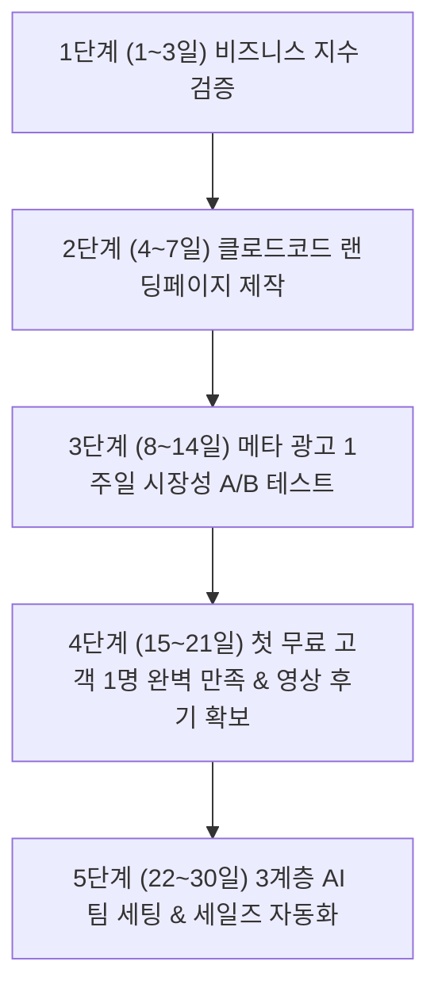

# 🚀 [FULL VER] 30일 안에 클로드코드로 1인 사업을 시작하는 완전 실행 바이블

> **"1인 유니콘 기업은 허상이 아니다. AI 팀을 구축하면 1인 기업이 수십 명 규모의 에이전시보다 빠르고 강력하게 수억 원대 매출을 만든다."**

---

## 📌 3대 핵심 요약

1. **검증되지 않은 사업에 돈과 시간을 쓰지 마라**: 비즈니스 지수(Biz Index) 공식으로 수요와 반복성을 사전 점수화하고 7일간 소액 메타 광고로 시장 반응을 100% 검증 후 착수한다.
2. **클로드 코드로 3시간 만에 랜딩페이지 & 리드 수집기 완성**: 300~500만 원짜리 외주 없이 Claude Code로 반응형 홈페이지를 직접 만들고 Tally 설문 폼을 연결해 즉각 고객 DB를 모은다.
3. **3계층 AI 팀(Raw Data - AI Wiki - Rules)으로 운영 자동화**: 지식 베이스를 계층화하여 콘텐츠 제작 대본 슬라이드 쇼폼 추출 세일즈 후속 상담까지 AI 에이전트 팀이 24시간 자동 실행하도록 구축한다.

---

## 🗺️ 30일 1인 AI 비즈니스 5단계 로드맵

---

## 🛠️ 단계별 실전 실행 가이드

### 1단계 (1~3일): 비즈니스 지수(Biz Index) 프롬프트 검증
* **분자 (높을수록 좋음)**:
  * **수요/고통(가중치 3.0)**: 지금 당장 돈을 내고 살 만큼 절박한 문제인가?
  * **반복성(가중치 4.5)**: 1회성 결제가 아닌 월 구독이나 재구매가 일어나는가?
  * **확장성(가중치 3.5)**: 내 시간을 1:1로 갈아넣지 않아도 소프트웨어/시스템으로 레버리지가 가능한가?
  * **해자(가중치 2.0)**: 경쟁자가 쉽게 복제할 수 없는 나만의 무기가 있는가?
* **분모 (낮을수록 좋음)**:
  * **자본 부담(2.5)** / **영업 강도(3.0)** / **경쟁 압력(2.0)**

---

### 2단계 (4~7일): 클로드 코드로 초고속 홈페이지 구축
* 외주 제작사에 맡기지 않고 Claude Code를 통해 **단 하루 만에 고전환 랜딩페이지를 직접 빌드**.
* 고객 페인포인트 ➔ 해결책 제시 ➔ 사회적 증거(후기) ➔ **Tally(탈리) 설문 신청 폼**으로 연결.

---

### 3단계 (8~14일): 메타(인스타/페북) 광고 시장 반응 테스트
* 하루 1~2만 원의 소액 예산으로 인스타그램 피드/릴스 스폰서 광고 집행.
* 클릭률(CTR)과 설문 신청 전환율을 측정하여 **"실제로 사람들이 반응하는가"를 수치 데이터로 확인**.

---

### 4단계 (15~21일): 첫 고객 1명 무료 확보 & 영상 추천사(Social Proof)
* 완벽한 유료급 서비스를 단 1명의 타겟 고객에게 100% 무료로 제공.
* 문제를 완벽히 해결해준 뒤 **진정성 있는 영상 인터뷰/텍스트 후기**를 받아 랜딩페이지에 탑재.

---

### 5단계 (22~30일): 3계층 AI 팀 아키텍처 구축
* **1층 (Raw Data)**: 고객 DB 원본 자료 제품 데이터.
* **2층 (AI Wiki)**: AI 에이전트들이 실시간으로 읽고 가공할 수 있는 마크다운 지식 베이스.
* **3층 (CLAUDE.md / Rules)**: 실시간 유입 고객 응대 유튜브 대본 생성 숏폼 컷팅을 처리하는 자동화 파이프라인.

## 관련
- 목차: [[04_부업_및_수익화_자동화/00_수익화_자동화_대시보드]]
