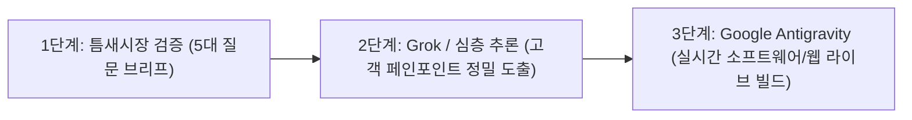

# 🚀 틈새시장 검증기 ➔ Grok 심층 분석 ➔ Google Antigravity 라이브 빌드 3단계 수익화 파이프라인

> **"남들이 다 뛰어드는 레드오션에서 삽질하지 않고, 틈새시장을 5개 질문으로 발굴한 뒤 Grok 분석을 거쳐 Antigravity에서 실시간 작동하는 디지털 상품을 완성하는 실전 공식"**

---

## 📌 3줄 핵심 요약

1. **레드오션 탈피 (Market Validator)**: 포화된 시장 대신 5가지 질문으로 경쟁이 적고 돈이 되는 '소외된 틈새시장(Underserved Niche)'을 1분 만에 검증한다.
2. **Grok 기반 타겟 앵글 도출**: 실시간 트렌드와 사용자 반응을 분석해 타겟 고객의 지갑을 열게 만드는 구체적인 세부 상품 컨셉(Offer Angle)을 뽑아낸다.
3. **Google Antigravity 라이브 빌드**: 기획안을 Antigravity에 주입하여 실제 사용 가능한 웹 툴, 디지털 PDF 툴킷, 랜딩페이지를 실시간으로 자동 개발한다.

---

## 🗺️ 3단계 초고속 빌드 아키텍처

---

## 💡 내(Antigravity) 시스템에 즉시 적용할 핵심 포인트 (적용 완료 ⭐)

1. **'5문항 틈새시장 검증 브리프' 템플릿 내장**:  
   사용자가 부업이나 상품 아이디어를 낼 때, 막연한 아이템 대신 `경험 / 타겟 고객 / 해결할 문제 / 전달 포맷 / 제약사항` 5개 질문으로 1분 만에 정밀 검증.
2. **Grok 추론 + Antigravity 라이브 코딩 연계**:  
   Grok이나 DeepSeek-R1의 심층 분석 결과를 Antigravity가 받아, 즉시 브라우저나 데스크톱에서 돌아가는 완성형 웹 애플리케이션으로 실시간 구현.

## 관련
- 목차: [[04_부업_및_수익화_자동화/00_수익화_자동화_대시보드]]

- Grok **API** 단가·봇 구독은 [[01_AI_시스템_및_도구/Grok_4.6_초가성비_성능분석_및_요금_한국원화_환산_가이드]] (X Premium 아님).
