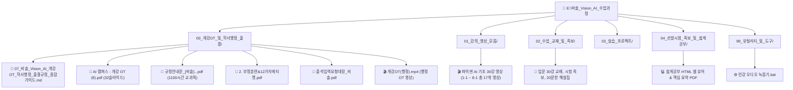

# 🎓 [비솔] Vision AI & Vertical AI 융합 전문가 과정 통합 대시보드

> **과정 개요**
> - **과정명**: `[비솔] 현장 데이터 기반 Vision AI & 산업분야 Vertical AI 융합 전문가 양성_2회차`
> - **교육기간**: **2026.08.27(개강) ~ 2027.03.23(수료)** (총 1,100시간 / 월~금 09:00~18:00)
> - **교육장소**: KH정보교육원 강남 (1관 2층 행정데스크 / 인공지능 융합가 교육장)
> - **담당진**: 담임 **박신우 강사님** / 취업 **안정옥 담당자님** / 행정팀 (`02-6952-0336`, `cookie0796@iei.or.kr`)
> - **전용 저장소 (E:)**: `E:\비솔_Vision_AI_수업과정\`

---

## 🗂️ 1. 체계적인 폴더 구조 및 파일 맵 (E: 드라이브)

---

## 📑 2. 주요 폴더별 상세 목록 및 바로가기

### 📂 `00_개강OT_및_학사행정_출결`
| 파일명 | 종류 | 주요 내용 |
| :--- | :---: | :--- |
| **07_비솔_Vision_AI_개강OT_학사행정_출결규정_종합가이드.md** | 마크다운 | 과정 일정, 박신우 강사님/행정팀 연락처, 비대면 행정신청 3단계, 40만원 수당, 출결/시설수칙 총정리 |
| **AI 캠퍼스 - 개강 OT (8).pdf** | PDF (32쪽) | KDT AI 캠퍼스 소개, On-Device/도메인 융합 인재상, PC 백업(바탕화면 저장 금지), 출결/수당 |
| **규정안내문_[비솔]...pdf** | PDF (3쪽) | 1,100시간 세부 교과목, 출석인정(공가), 휴가(월 1일 적치, 전일 18시 마감) 공식 기준표 |
| **2. 부정훈련&12가지에티켓.pdf** | PDF (9쪽) | 부정수급 7대 사례(대리출석/외출/알바 은폐), 직업훈련 권리장전 12대 에티켓 |
| **출석입력요청대장_비솔.pdf** | PDF (1쪽) | 결석/휴가 시 비대면 제출하는 공식 서식 (별지 제13호 서식) |
| **개강OT(행정).mp4** | 동영상 | 행정팀 공식 개강 OT 안내 영상 |

---

### 📂 `01_강의_영상_모음`
* **파이썬 AI 기초 30강 동영상 모음** (1-1부터 8-1까지 총 15개 분할 MP4 + 인공지능 해설 오디오/영상 총 17개 파일 보관)
* 인덱스 링크: [[05_AI_기초_강의_영상_30강_전체목차_및_로컬파일_인덱스]]

---

### 📂 `02_수업_교재_및_족보`
* [[01_Vision_AI_선발기술시험_34주제_초간단_100점_합격노트]]
* [[02_Python_AI_입문_30강_전단원_핵심정복_마스터교재]]
* [[03_Python_AI_초보자_시험대비_핵심핸드북]]
* [[04_Python_AI_완전초보_진짜배움_가이드북]]
* [[06_비솔_현장_데이터_기반_Vision_AI_20문항_평가시험_문제_및_정답_해설집]]
* `비솔_Vision_AI_선발기술시험_100점_합격노트.pdf`
* `KH_AICampus_개념 학습집(훈련생용).pdf`

---

### 📂 `04_선발시험_족보_및_쉽게공부`
* `비솔_선발시험_쉽게공부.html` (브라우저에서 바로 여는 인터랙티브 용어사전 & 문제풀이)
* `비솔_선발시험_쉽게공부.pdf` (인쇄 및 태블릿용 핵심 요약 PDF)

---

### 📂 `99_유틸리티_및_도구`
* `인강 오디오 녹음기.bat` (온라인 강의 오디오 캡처용 자동화 배치파일)