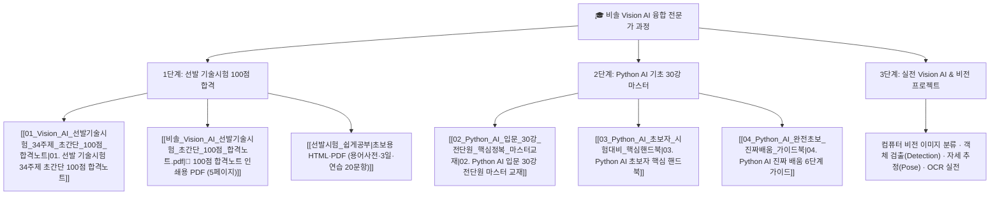

# 🎓 [비솔] Vision AI & Vertical AI 융합 전문가 과정 통합 대시보드

> **자료 위치 (2026-08-15 확인)**: 교재 md 01–04와 PDF는 `수업_교재_및_족보/` 안에 있다. OneDrive 바탕화면 경로는 폐기. 강의 영상은 `D:\개인자료\시험_및_학습자료\Ai 기초 강의 영상 모음` (문서 폴더에 없음).
> **초보용 공부 팩**: 바탕화면 오른쪽 위 `C:\Users\ildoc\Desktop\비솔_선발시험_쉽게공부\` · 노트 [[선발시험_쉽게공부]]

> **📌 과정 개요**
> - **교육과정명**: 현장 데이터 기반 Vision AI & 산업분야 Vertical AI 융합 전문가 양성 과정
> - **주관 기관**: ㈜비솔 (Visol) & AI Campus
> - **독립 깃허브 저장소**: `https://github.com/incarnation44/visol-vision-ai-course`
> - **보관소 폴더**: `06_비솔_Vision_AI_수업과정/`
> - **학습 목표**: 선발 기술시험 100점 만점 합격 ➔ 파이썬 AI 기초 30강 마스터 ➔ 산업용 컴퓨터 비전(Vision AI) 실무 프로젝트 완수

---

## 📚 1. 학습 자료 구성 및 목차

---

## 📑 2. 세부 교재 바로가기

| 단계 | 교재명 | 주요 내용 | 링크 |
| :---: | :--- | :--- | :---: |
| **🚀 선발시험** | **선발 기술시험 34주제 100점 합격노트** | 비솔 박성수 부장 출제 34개 주제 (SW기초 12개, OOP 10개, AI기초 12개) 일상 비유 완벽 족보 | [[01_Vision_AI_선발기술시험_34주제_초간단_100점_합격노트]] |
| **📄 PDF** | **100점 합격노트 인쇄용 PDF** | 총 5페이지 분량의 초간단 A4 출력용 실물 PDF 족보 | [[비솔_Vision_AI_선발기술시험_초간단_100점_합격노트.pdf]] |
| **🖥 쉽게공부** | **선발시험 HTML·PDF (초보용)** | 용어 사전 + 34주제 + 3일 계획 + 연습 20문항. 바탕화면 오른쪽 위 폴더 | [[선발시험_쉽게공부]] |
| **🎬 강의영상** | **AI 기초 강의 영상 30강 전체 인덱스** | 로컬 MP4 15개 파일(30강) 1:1 매핑표 및 핵심 키워드 인덱스 | [[05_AI_기초_강의_영상_30강_전체목차_및_로컬파일_인덱스]] |
| **📘 입문 30강** | **Python AI 30강 마스터 교재** | 인공지능 개론부터 머신러닝, 딥러닝, 파이썬 기초 전 단원(01-01~08-01) 총망라 | [[02_Python_AI_입문_30강_전단원_핵심정복_마스터교재]] |
| **📗 요약집** | **Python AI 핵심 핸드북** | 시험 직전 10분 총정리 핵심 개념 요약본 | [[03_Python_AI_초보자_시험대비_핵심핸드북]] |
| **📙 원리이해** | **0부터 시작하는 진짜배움 교과서** | 초보자 눈높이에서 개념과 원리를 꿰뚫는 6단계 해설서 | [[04_Python_AI_완전초보_진짜배움_가이드북]] |
| **🧒 12살 일지** | **파이썬 AI 탐험 일지** | 코랩 vs 스탠드얼론, 로봇 기자, AI 3단 진화. 본문 md는 01_AI, PDF는 이 폴더 | [[12살_코딩_마법사를_위한_파이썬_AI_탐험_일지.pdf]] |
| **📘 퀴즈 PDF** | **파이썬·AI 기초 학습 가이드** | 단답 10문항 + 해설. OneDrive 아님 | [[파이썬_프로그래밍과_인공지능_기초_학습_가이드.pdf]] |
| **📄 과정 탐색** | **AI 교육 과정 상세 정보** | 과정 안내 PDF | [[AI 교육 과정 상세 정보 탐색.pdf]] |

---

## 🧭 3. 주차별 학습 로드맵

1. **1주차 (선발 & 기초 다지기)**:
   - 기술시험 20문항 100점 합격 (60점 합격 커트라인 여유롭게 돌파)
   - 변수, 메모리, 객체지향 4대 특징(캡상다추), 머신러닝 vs 딥러닝 차이 정리
   - 초보용: [[선발시험_쉽게공부]] 용어 사전부터
2. **2~3주차 (파이썬 & 데이터 핸들링)**:
   - Python 문법, Numpy / Pandas를 활용한 데이터 분석 및 전처리
   - 지도학습 / 비지도학습 / 과적합(Overfitting) 방지 실습
3. **4주차 이후 (본격 Vision AI 실무)**:
   - OpenCV 영상 처리 기초
   - 객체 검출(YOLO 등), 이미지 분류(CNN), 사람 자세 추정(Pose Estimation), OCR 실전 프로젝트
