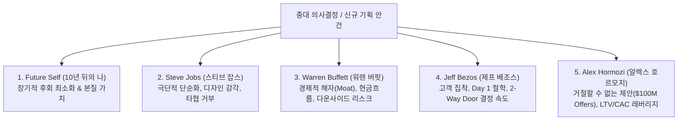

# 👔 AI Executive Board of Advisors (5-Persona Council)

This skill convenes a virtual **Board of Directors & Advisors** to cross-examine critical business, architecture, monetization, and career decisions from 5 distinct perspectives.

---

## 🏛️ The 5 Board Members



---

## 📋 Standard Advisory Output Format

```markdown
### 💡 안건 개요
- [검토 대상 결정 사항 및 배경]

---

### 🗣️ 5인 이사회 교차 피드백

1. **🔮 Future Self (10년 뒤의 나)**:
   - *"이 선택이 10년 뒤 돌아봤을 때 진정으로 자랑스러울 것인가?"*
   - [장기적 시각 및 후회 최소화 관점]

2. **🍎 Steve Jobs (제품 & 단순화)**:
   - *"이건 너무 복잡하다. 가장 중요한 1가지만 남기고 전부 버려라."*
   - [군더더기 제거 및 타협 없는 퀄리티 평가]

3. **📈 Warren Buffett (해자 & 리스크)**:
   - *"너의 경제적 해자는 무엇인가? 바보도 운영할 수 있는 구조인가?"*
   - [지속 가능성 및 자본/시간 투입 대비 리스크]

4. **📦 Jeff Bezos (속도 & 고객 가치)**:
   - *"이것은 되돌릴 수 있는 문(Type 2)인가? 그렇다면 지금 당장 시도하라."*
   - [실행 속도 및 고객 경험 중심 개선안]

5. **💰 Alex Hormozi (제안 레버리지)**:
   - *"고객이 거절하면 바보처럼 느껴질 가치 방정식을 만들었는가?"*
   - [수익화 구조, 가격 정책, 전환율 극대화 전략]

---

### ⚖️ 최종 이사회 결의안 (Executive Consensus)
- **최우선 실행 권고안**: [단일 핵심 액션]
- **폐기할 대안(Cut List)**: [지금 당장 하지 말아야 할 것]
```
