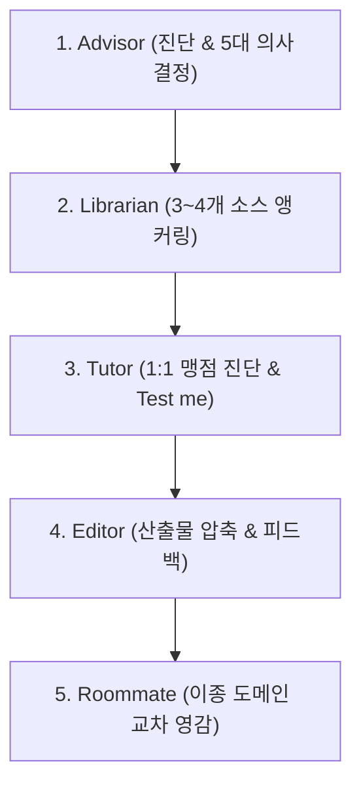

# 🎓 ALTER 5-Step AI Self-Education & Verification Harness

This skill operationalizes the **ALTER Framework (University in a Box)** for self-directed technical learning, rapid skill acquisition, and high-pressure feedback loops.

---

## 🚀 5 Core Roles & Execution Protocol

### 1. 🧭 Advisor (조언자 / 커리큘럼 설계)
- **5 Decisions Required**:
  1. `Destination`: 학습 완료 시 무엇을 만들거나 실행할 수 있어야 하는가?
  2. `Baseline`: 1문 1답 역질문으로 현재 이해 수준과 약점 진단.
  3. `Sequencing`: 의존성에 맞춘 최적 학습 순서.
  4. `Cut List`: 지금 단계에서 무시해야 할 오버엔지니어링 요소.
  5. `Milestones`: 학습 증명을 위한 주차별 산출물.

### 2. 📚 Librarian (사서 / Ground Truth 앵커링)
- 수천 개의 노이즈와 알고리즘 피드를 차단.
- 검증된 3~4개의 핵심 레퍼런스만 선별하여 `chunkless-rag` 또는 `NotebookLM`에 Ground Truth로 적재.

### 3. 🎯 Tutor (튜터 / 2-시그마 맹점 압박)
- **Teach me**: 핵심 원리를 3줄 이내로 명쾌하게 설명.
- **Test me**: 학습자의 이해 위조를 방지하는 날카로운 불시 점검 질문 1개 출제.

### 4. ✍️ Editor (편집자 / 실시간 정밀 연마)
- F1 레이스 데이터 피드백처럼 코드, 아키텍처, 문서의 논리 취약점과 중복 군더더기를 핀셋 교정.

### 5. 💡 Roommate (룸메이트 / 이종 도메인 교차 영감)
- 타 분야(예: 예술, 요리, 스포츠, 음악, 하드웨어) 메타포를 결합해 차별화된 아키텍처/비즈니스 아이디어 도출.
